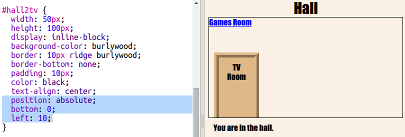

## दरवाज़ों की तरह दिखाई देने वाले लिंक बनाएँ

लिंक के लिए सिर्फ टेक्स्ट (text) होना जरूरी नहीं है। एक `
` का उपयोग करके क्लिक करने योग्य दरवाजा बनाते हैं।

+ `index.html` खोलें और `
` **TV Room** के आसपास लिंक टेक्स्ट जोड़ें। इसे क्लिक करने योग्य बनाने के लिए इसे `<a>` के अंदर होना चाहिए।
    
    इसे Hall से TV Room के दरवाजे के रूप में लेबल करने के लिए जोड़ें `id="hall2tv"` ताकि आप दरवाजे को स्टाइल कर सकें।
    
    

+ `style.css` पर क्लिक करें, नीचे जाएं और दरवाजे के आकार और रंग को बदलने के लिए निम्न CSS जोड़ें:
    
    

+ दरवाजे पर क्लिक करके अपने वेबपेज का परीक्षण करें, केवल टेक्स्ट (text) पर नहीं |

+ अब इसे तीन तरफ से बॉर्डर जोड़कर एक दरवाजे की तरह बनाते हैं:
    
    

+ और चलो कुछ CSS जोड़ते हैं ताकि दरवाजे पर पाठ बेहतर दिख सके:
    
    

+ आपने शायद ध्यान दिया हो कि दरवाजा हवा में तैर रहा है। चलो उस कमरे के अंदर दरवाजे की स्थिति को ठीक करते हैं।
    
    

+ **TV Room** में जाने के लिए दरवाजे पर क्लिक करके अपने वेबपेज का परीक्षण करें।