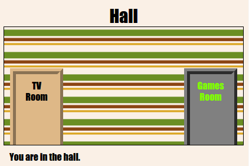

## Uvod

U ovom projektu izradit ćete skup povezanih soba u kojima svaka soba predstavlja drugu web stranicu koju možete ukrasiti s HTML-om.

  <iframe src="https://trinket.io/embed/html/ba5d27ec68?outputOnly=true&start=result" width="600" height="450" frameborder="0" marginwidth="0" marginheight="0" allowfullscreen>
  </iframe>
  

**Upute**: Kliknite vrata za kretanje između soba.

### Dodatne informacije za voditelje kluba

Ako trebate ispisati ovaj projekt, molimo koristite [Verzija za ispis](https://projects.raspberrypi.org/en/projects/linked-rooms/print).

## \--- kolaps \---

## naslov: Bilješke voditelja kluba

## Uvod:

U ovom projektu, djeca se upisuju na više povezanih web stranica u istom projektu s vlastitom CSS datotekom.

## Online resursi

Preporučujemo upotrebu [triketa](https://trinket.io/) za pisanje HTML & CSS-a na mreži. Ovaj projekt sadrži sljedeće trikove:

* [Polazna točka "Povezane sobe" - jumpto.cc/web-rooms](http://jumpto.cc/web-rooms)

Djeca također mogu koristiti ovu praznu nakit [(jumpto.cc/html-blank)](http://jumpto.cc/html-blank) da napišu vlastiti HTML & CSS ili alternativno mogu koristiti ovaj predložak nakita [(jumpto.cc/html-template)](http://jumpto.cc/html-template).

Tu je i trikota s rješenjem uzorka izazovima:

* ["Povezane sobe završene" - https://trinket.io/html/ba5d27ec68](https://trinket.io/html/ba5d27ec68)

## Offline resursi

Ovaj projekt može biti [završen offline](https://www.codeclubprojects.org/en-GB/resources/webdev-working-offline/) ako je željena. Možete pristupiti resursima projekta klikom na vezu "Projekti materijali" za ovaj projekt. Ova veza sadrži odjeljak "Projektni resursi", koji uključuje resurse koje će djeca morati dovršiti ovaj projekt izvan mreže. Pazite da svako dijete ima pristup kopiji tih resursa. Ovaj odjeljak sadrži sljedeće datoteke:

* povezane-sobe / index.html
* povezane-sobe / style.css
* povezane-sobe / script.js
* povezane-sobe / prefixfree.js
* povezane sobe / 4 x .png slike
* predložak / template.html
* predložak / style.css

Također možete naći dovršenu verziju izazova ovog projekta u odjeljku "Volonterski resursi", koji sadrži:

* povezane-sobe-gotov / index.html
* povezane-sobe-gotov / style.css
* povezane-sobe-gotov / script.js
* povezane-sobe-gotov / prefixfree.js
* povezane sobe / 4 x .png slike

(Sve gore navedene resurse također se mogu preuzeti kao projekt i dobrovoljno `.zip` datoteke.)

## ciljevi učenja

* Ovaj projekt uvodi projekte s više HTML stranica povezanih zajedno
* Uvedene su i više CSS datoteka

Ovaj projekt pokriva elemente iz sljedećih niza [Raspberry Pi Digital Making Curriculum](http://rpf.io/curriculum):

* [Oblikujte osnovne 2D i 3D snimke](https://www.raspberrypi.org/curriculum/design/creator).

## Izazovi

* "Dodaj drugu vezu" - dodajte vezu između stranica u istom projektu;
* "Stil i povezivanje sobi za igru" - dodajte vezu i stil stranicu s vlastitom CSS datotekom. 
* "Dodaj još vrata!" - Koristite 

<

div> linkovi koji se mogu kliknuti + "Dodaj pozadinu u sobi za igre" - Dodajte pozadinsku sliku + "Pripazite!" - Dodajte više soba pomoću naučenih vještina + "Dodavanje tipkovnog kursora" - Zabava dodatna opcija za one koji završavaju projekt

\--- /kolaps \---

## \--- kolaps \---

## Naslov: Projektni materijali

## Resursi projekta

* [.zip datoteku koja sadrži sve resurse projekta](resources/rooms-project-resources.zip)
* [Online Trinket koji sadrži sve resurse projekta "Povezane sobe"](http://jumpto.cc/web-rooms)
* [Predložak Online Trinket](http://jumpto.cc/trinket-template)
* [Online prazno trinket](http://jumpto.cc/trinket-blank)
* [predložak / index.html](resources/template-index.html)
* [predložak / style.css](resources/template-style.css)
* [povezane-sobe / index.html](resources/linked-rooms-index.html)
* [povezane-sobe / style.css](resources/linked-rooms-style.css)
* [povezane-sobe / tvroom.html](resources/linked-rooms-tvroom.html)
* [povezane-sobe / tvroom.css](resources/linked-rooms-tvroom.css)
* [povezane-sobe / wallpaper.png](resources/linked-rooms-wallpaper.png)
* [povezane sobe na / prostor-invader.png](resources/linked-rooms-space-invader.png)
* [povezane-sobe / tiles.png](resources/linked-rooms-tiles.png)
* [povezane-sobe / star.png](resources/linked-rooms-star.png)
* [povezane-sobe / stripes.png](resources/linked-rooms-stripes.png)

## Resursi za vođe kluba

* [.zip datoteku koja sadrži sve dovršene resurse projekta](resources/rooms-volunteer-resources.zip)
* [Online završio projekt Trinket](https://trinket.io/html/1d4d4c5ce1)
* [povezane-sobe-gotov / index.html](resources/linked-rooms-finished-index.html)
* [povezane-sobe-gotov / style.css](resources/linked-rooms-finished-style.css)
* [povezane-sobe-gotov / tvroom.html](resources/linked-rooms-finished-tvroom.html)
* [povezane-sobe-gotov / tvroom.css](resources/linked-rooms-finished-tvroom.css)
* [povezane-sobe-gotov / gamesroom.html](resources/linked-rooms-finished-gamesroom.html)
* [povezane-sobe-gotov / gamesroom.css](resources/linked-rooms-finished-gamesroom.css)
* [povezane-sobe-gotov / wallpaper.png](resources/linked-rooms-finished-wallpaper.png)
* [povezane sobe na dovršenim / prostor-invader.png](resources/linked-rooms-finished-space-invader.png)
* [povezane-sobe-gotov / tiles.png](resources/linked-rooms-finished-tiles.png)
* [povezane-sobe-gotov / star.png](resources/linked-rooms-finished-star.png)
* [povezane-sobe-gotov / stripes.png](resources/linked-rooms-finished-stripes.png)

\--- /kolaps \---