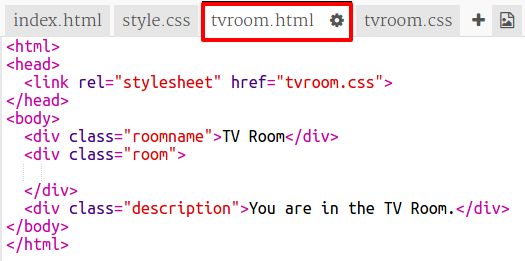

## Povezivanje na drugu web stranicu u istom projektu

Web projekti mogu biti sastavljeni od puno HTML datoteka povezanih zajedno.

+ Otvori ovaj trinket: <a href="http://jumpto.cc/web-rooms" target="_blank">jumpto.cc/web-rooms</a>.
    
    Projekt bi trebao izgledati ovako:
    
    

+ Trinket bi trebao biti autorun i naći ćete se u dvorani:
    
    

+ Pogledajte popis datoteka kartica za ovaj trik. Možete li vidjeti `tvroom.html`? Kliknite na njega.
    
    
    
    Ovo je još jedna html datoteka u istom projektu.

+ Da biste došli do stranice `tvroom.html` , morate dodati vezu u `index.html`.
    
    Dodajte označeni kôd unutar `
` sa sobom `klase`:
    
    

+ Testirajte svoju nakit tako da kliknete vezu **TV soba** da biste vidjeli `tvroom.html` web stranicu.
    
    Imajte na umu da `tvroom.html` također ima svoju `tvroom.css` datoteku stila koja definira izgled ove stranice.
    
    