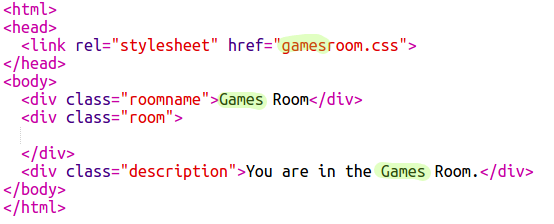

## Dodaj još jednu sobu

Sada dodajmo još jednu sobu, **Igralište**.

+ Kliknite gumb za dodavanje stranice **+**:
    
    
    
    Upišite `gamesroom.html` kao naziv stranice:
    
    

+ HTML za **Games Room** vrlo je sličan `tvroom.html` pa **kopira** da i **zalijepi** u `gamesroom.html`.
    
    Uredite istaknute stavke tako da kažu Igre ne TV:
    
    

+ Vaš `gamesroom.html` sada koristi `gamesroom.css` koji još ne postoji.
    
    Stvorite `gamesroom.css` klikom na gumb Dodaj stranicu **+**.

+ CSS za **Games Room** je vrlo sličan `tvroom.css` pa **kopira** da i **zalijepiti** u `gamesroom.css`.
    
    

+ Dodajte vezu s Dvorane u sobi za igre:
    
    

+ Isprobajte svoj projekt klikom na vezu Games Room
    
    **Igraonica** treba izgledati ovako:
    
    
    
    Nije baš uzbudljivo, ali to možete riješiti u sljedećem izazovu.