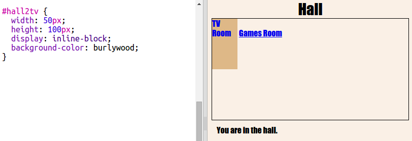
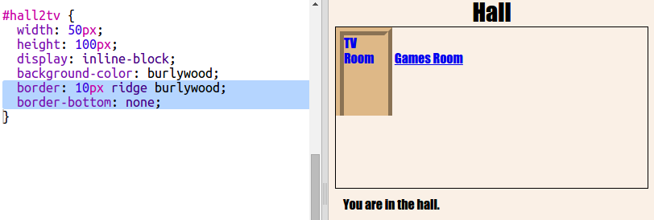

## Neka veze izgledaju kao vrata

Veze ne moraju samo biti tekstovi. Napravimo vrata koja se mogu kliknuti pomoću `
`.

+ Otvorite `index.html` i dodajte `
` oko **TV soba** tekst veze. Mora biti unutar `<a>` da bi se kliknulo.
    
    Dodajte `id = "hall2tv"` kako biste je označili kao vrata iz Dvorane u TV sobi kako biste mogli oblikovati vrata.
    
    

+ Kliknite tablicu `style.css` , idite na dno i dodajte sljedeći CSS da biste promijenili veličinu i boju vrata:
    
    

+ Testirajte svoju web stranicu klikom na bilo gdje na vratima, ne samo na tekstu.

+ Sada neka izgleda malo više poput vrata dodavanjem granice oko tri strane:
    
    

+ Dodajte još neke CSS kako bi tekst na vratima izgledao bolje:
    
    

+ Vjerojatno ste primijetili da vrata plutaju u zraku. Popravimo to postavljanjem vrata unutar sobe.
    
    

+ Test your webpage by clicking on the door to get to the **TV Room**.