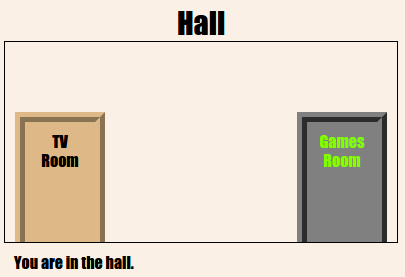

\--- izazov \---

## Izazov: Dodajte još vrata!

Na isti način okrenite druge veze u svoj projekt na vrata.

Za svaku ćete vrata morati:

+ Uredite vezu za vrata da biste upotrijebili `
` s ID-om kao što je `hall2games` da biste ga mogli oblikovati.
    
    Na primjer:
    
    `<a href="gamesroom.html">
Igraonica
</a>`

+ Dodajte CSS za ID vrata u `.css` datoteku za svoju sobu. Koristite *kopiju* i *zalijepite* da biste uštedjeli vrijeme. Svaka vrata mogu izgledati drugačije, ako vam se sviđa.

+ Postavite vrata pomoću `dna:` i `lijevo:` ili `desno:`.

Dvorana može izgledati ovako:

TV soba bi trebala izgledati ovako:

\--- / izazov \---