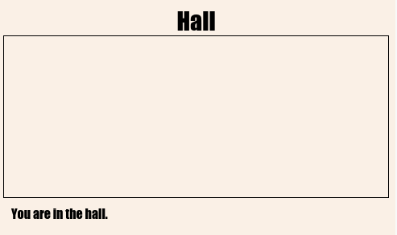

## Collegamento a un’altra pagina Web dello stesso progetto

I progetti sul Web possono essere composti da numerosi file HTML collegati tra loro.

+ Apri questo trinket: <a href="http://jumpto.cc/web-rooms" target="_blank">jumpto.cc/web-rooms</a>.

	Il progetto si presenta così:

	

+ Trinket dovrebbe venire eseguito automaticamente e ti ritroverai nella Hall (Ingresso):

	

+ Osserva l’elenco delle schede dei file di questo trinket. Vedi il file `tvroom.html`? Fai clic su quel file.

	

	Si tratta di un altro file html dello stesso progetto.

+ Per passare a `tvroom.html` devi aggiungere un link a `index.html`.

	Aggiungi il codice evidenziato all’interno del tag `
` con `room` (stanza) come classe:

	

+ Verifica il trinket facendo clic sul link __TV Room__ (Sala TV) per visualizzare la pagina Web `tvroom.html`.

	`tvroom.html` presenta anche il suo file di stile `tvroom.css` che definisce il layout della pagina.

	

	
