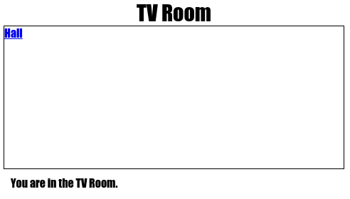

--- challenge ---
## Sfida: Aggiungi un altro link 

Aggiungi un link `<a>` alla pagina Web `tvroom.html` per poter tornare alla Hall, la pagina di Ingresso denominata `index.html`. Il testo del link deve essere "Hall" (Ingresso).

La pagina Web TV Room (Sala TV) dovrebbe ora disporre di un link come questo sul quale è possibile fare clic:

Assicurati di testare il codice. Dovresti riuscire a spostarti dalla Hall (Ingresso) alla TV Room (Sala TV) e viceversa facendo clic sui link.  

--- /challenge ---