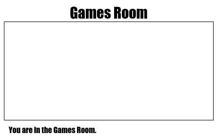

## Aggiungi un’altra stanza

Aggiungiamo ora un’altra stanza, la __Games Room__ (Stanza dei giochi).

+ Fai clic sul pulsante __+__ di aggiunta di una pagina:

	

	Come nome della pagina, digita `gamesroom.html`:

 	

+ L’HTML per la __Games Room__ (Stanza dei giochi) è molto simile al codice del file `tvroom.html`; per cui __copia__ tale codice e __incollalo__ nella pagina `gamesroom.html`.

	Modifica gli elementi evidenziati in modo che vi sia scritto Games e non TV:

	

+ La pagina `gamesroom.html` utilizza `gamesroom.css` che ancora non esiste.

	Crea `gamesroom.css` facendo clic sul pulsante __+__ di aggiunta di una pagina.

+ Il CSS per la __Games Room__ (Stanza dei giochi) è molto simile al codice del file `tvroom.css`; per cui __copia__ tale codice e __incollalo__ nella pagina `gamesroom.css`.

	

+ Aggiungi un link dalla Hall (Ingresso) alla Games room (Stanza dei giochi):

	

+ Verifica il progetto facendo clic sul link Games Room (Stanza dei giochi)

	La __Games Room__ (Stanza dei giochi) si presenta così:

	

	Non proprio divertente, ma possiamo migliorarla con la prossima sfida.

