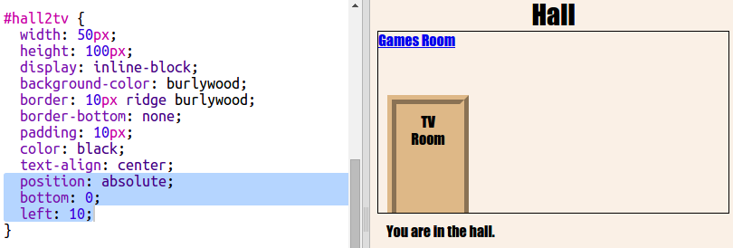

## Trasformiamo i link in porte

I link non devono essere per forza composti da testo. Realizziamo una porta selezionabile usando un tag `
`.

+ Apri `index.html` e aggiungi un tag `
` attorno al testo del link __TV Room__ (Sala TV). Deve essere all’interno del tag `<a>` per essere selezionabile.

  Aggiungi `id="hall2tv"` in modo che sia la porta dalla Hall (Ingresso) alla TV Room (Sala TV) e poter attribuire uno stile alla porta.

    

+ Fai clic sulla scheda `style.css`, scorri verso il basso e aggiungi il seguente codice CSS per modificare le dimensioni e il colore della porta:

	

+ Verifica la pagina Web facendo clic ovunque sulla porta, non solamente sul testo.

+ Ora rendiamola un po’ più simile a una porta aggiungendo un bordo su tre lati:

	

+ E aggiungiamo codice CSS per migliorare il testo presente sulla porta:

	

+ Avrai probabilmente notato che la porta è sospesa in aria. Risolviamo il problema posizionando la porta all’interno della stanza.

	

+ Verifica la pagina Web facendo clic sulla porta per passare alla __TV Room__ (Sala TV).
