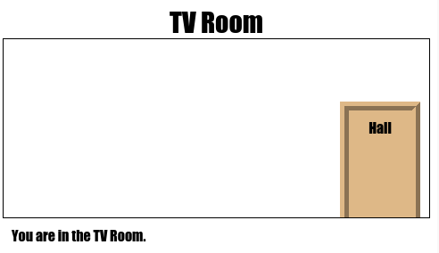

--- challenge ---
## Sfida: Aggiungi altre porte!

Usando la stessa procedura, trasforma anche gli altri link del progetto in porte.

Per ciascuna porta, dovrai:

+ Modificare il link della porta utilizzando un tag `
` con un id quale `hall2games` in modo da potergli attribuire uno stile.

	Ad esempio:

	`<a href="gamesroom.html">
Games Room
</a>`

+ Aggiungere codice CSS per l’id della porta al file `.css` della relativa stanza. Usa _copia_ e _incolla_ per risparmiare tempo. Puoi fare in modo che ogni porta sia diversa dall’altra.

+ Posizionare la porta usando `bottom:` (basso) e `left:` (sinistra) o `right:` (destra).

La Hall (Ingresso) potrebbe presentarsi così:

La TV Room__ (Sala TV) dovrebbe essere simile a:

--- /challenge ---