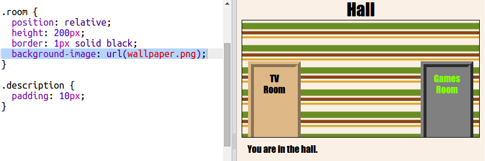

## Aggiunta di un’immagine di sfondo

Decoriamo la Hall (Ingresso) con un’immagine di sfondo.

+ Modifica `style.css` per aggiungere un’immagine sullo sfondo della Hall (Ingresso):

	

	L’immagine sarà ripetuta in modo da riempire l’intera stanza.

