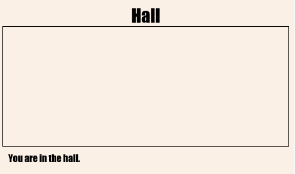
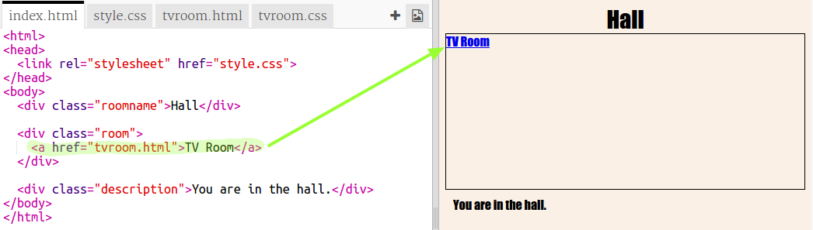

## ಅದೇ ಯೋಜನೆಯಲ್ಲಿ ಮತ್ತೊಂದು ವೆಬ್ ಪುಟಕ್ಕೆ ಲಿಂಕ್ ಮಾಡಲಾಗುತ್ತಿದೆ

ವೆಬ್ ಯೋಜನೆಗಳನ್ನು(projects) ಒಟ್ಟಿಗೆ ಲಿಂಕ್ ಮಾಡಲಾದ ಸಾಕಷ್ಟು HTML ಫೈಲ್‌ಗಳಿಂದ ಮಾಡಬಹುದಾಗಿದೆ.

+ ಈ ಟ್ರಿಂಕೆಟ್ ತೆರೆಯಿರಿ: <a href="https://trinket.io/html/f1486ddb24" target="_blank">jumpto.cc/web-rooms</a>.
    
    ಯೋಜನೆಯು ಈ ರೀತಿ ಕಾಣಿಸಬೇಕು:
    
    

+ Trinket ಆಟೋರನ್ ಆಗಬೇಕು ಮತ್ತು ನೀವು ಹಾಲ್‌ನಲ್ಲಿ ಕಾಣುವಿರಿ:
    
    

+ ಈ Trinket ಗಾಗಿ ಫೈಲ್ ಟ್ಯಾಬ್‌ಗಳ ಪಟ್ಟಿಯನ್ನು ನೋಡಿ. ನೀವು `tvroom.html` ನೋಡಬಹುದೇ? ಇದರ ಮೇಲೆ ಕ್ಲಿಕ್ ಮಾಡಿ.
    
    
    
    ಅದೇ ಯೋಜನೆಯಲ್ಲಿ ಇದು ಮತ್ತೊಂದು html ಫೈಲ್ ಆಗಿದೆ.

+ `tvroom.html` ಪಡೆಯಲು ನಿಮಗೆ `index.html`ನಲ್ಲಿ ಲಿಂಕ್ ಅನ್ನು ಸೇರಿಸುವ ಅಗತ್ಯವಿದೆ.
    
    ಹೈಲೈಟ್ ಮಾಡಿರುವ ಕೋಡ್ ಅನ್ನು `
` ಜೊತೆಗಿರುವ `room` ನ ಒಳಗಡೆ ಸೇರಿಸಿ:
    
    

+ `tvroom.html` ವೆಬ್ ಪುಟವನ್ನು ನೋಡಲು **TV Room** ಲಿಂಕ್ ಅನ್ನು ಕ್ಲಿಕ್ ಮಾಡುವ ಮೂಲಕ ಟ್ರಿಂಕೆಟ್ ಅನ್ನು ಪರೀಕ್ಷಿಸಿ.
    
    `tvroom.html` ಎಂಬುದು ಈ ಪೇಜ್ ಗೆ ಲೇಔಟ್ ಅನ್ನು ವರ್ಣಿಸುವ ತನ್ನದೇ ಆದ `tvroom.css` ಶೈಲಿಯ ಫೈಲ್ ಹೊಂದಿದೆ ಎಂಬುದನ್ನು ನೆನಪಿಡಿ.
    
    