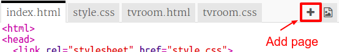

## ಮತ್ತೊಂದು ಕೋಣೆಯನ್ನು ಸೇರಿಸಿ

ಈಗ ಮತ್ತೊಂದು ಕೋಣೆಯನ್ನು ಸೇರಿಸೋಣ, **Games Room**.

+ add page **+** ಬಟನ್ ಮೇಲೆ ಕ್ಲಿಕ್ ಮಾಡಿ:
    
    
    
    `gamesroom.html` ಎನ್ನುವುದನ್ನು ಪುಟದ ಹೆಸರಾಗಿ ಟೈಪ್ ಮಾಡಿ:
    
    

+ **Games Room** ಗಾಗಿ HTML, `tvroom.html` ಎನ್ನುವುದನ್ನು ಹೋಲುತ್ತದೆ. ಆದ್ದರಿಂದ ಅದನ್ನು `gamesroom.html` ನ್ ಒಳಗೆ **copy** ಮತ್ತು **paste** ಮಾಡಿ.
    
    ಹೈಲೈಟ್ ಮಾಡಿದ ಅಂಶಗಳನ್ನು ತಿದ್ದಿರಿ ಆದ್ದರಿಂದ ಆಟಗಳು ಟಿವಿಯಲ್ಲ ಎಂದು ಅವರು ಹೇಳಬಹುದು:
    
    

+ ನಿಮ್ಮ `gamesroom.html` ಈಗ, ಅಸ್ತಿತ್ವದಲ್ಲಿ ಇಲ್ಲದ `gamesroom.css` ಎನ್ನುವುದನ್ನು ಉಪಯೋಗಿಸುತ್ತದೆ.
    
    add page **+** ಬಟನ್ ಕ್ಲಿಕ್ ಮಾಡುವುದರ ಮೂಲಕ `gamesroom.css` ಅನ್ನು ರಚಿಸಿ.

+ **Games Room** ಗಾಗಿ CSS, `tvroom.css` ಎನ್ನುವುದನ್ನು ಹೋಲುತ್ತದೆ. ಆದ್ದರಿಂದ ಅದನ್ನು `gamesroom.css` ನ್ ಒಳಗೆ **copy** ಮತ್ತು **paste** ಮಾಡಿ.
    
    

+ ಹಾಲ್ ನಿಂದ ಆಟಗಳ ಕೋಣೆಗೆ ಲಿಂಕ್ ಸೇರಿಸಿ:
    
    

+ Games Room ಲಿಂಕ್ ಮೇಲೆ ಕ್ಲಿಕ್ ಮಾಡುವ ಮುಖಾಂತರ ನಿಮ್ಮ ಯೋಜನೆಯನ್ನು ಪರೀಕ್ಷಿಸಿ
    
    **Games Room** ಈ ರೀತಿಯಾಗಿ ಕಾಣಬೇಕು:
    
    
    
    ತುಂಬಾ ರೋಮಾಂಚನಕಾರಿಯಲ್ಲ, ಆದರೆ ನೀವು ಅದನ್ನು ಮುಂದಿನ ಸವಾಲಿನಲ್ಲಿ ಸರಿಪಡಿಸಬಹುದು.