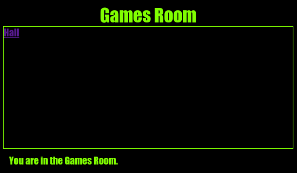

--- challenge ---

## ಸವಾಲು: ಆಟಗಳ ಕೋಣೆಯನ್ನು ಶೈಲಿಯನ್ನಾಗಿ ಮತ್ತು ಲಿಂಕ್ ಮಾಡಿ

**Games Room** ಗೆ HTML ಮತ್ತು CSS ಅನ್ನು ತಿದ್ದಿರಿ ಆದ್ದರಿಂದ ವೆಬ್ ಪುಟವು ಈ ರೀತಿ ಕಾಣುತ್ತದೆ:

ಸುಳಿವು: ನೀವು `gamesroom.css`ನಲ್ಲಿ ಹಿನ್ನೆಲೆ ಬಣ್ಣ, ಫಾಂಟ್ ಬಣ್ಣ ಮತ್ತು ಬಾರ್ಡರ್ ಬಣ್ಣವನ್ನು ಬದಲಿಸಬೇಕಾಗುತ್ತದೆ. ಪ್ರಕಾಶಮಾನವಾದ ಹಸಿರು ಬಣ್ಣವನ್ನು `chartreuse` ಎಂದು ಕರೆಯಲಾಗುತ್ತದೆ.

ಸುಳಿವು: ನೀವು, `index.html` ಗೆ ಸಂಪರ್ಕ ಹೊಂದಿರುವ `gamesroom.html` ನಲ್ಲಿ ಒಂದು `<a>` ಲಿಂಕ್ ಅನ್ನು ಸೇರಿಸಬೇಕಾಗುತ್ತದೆ.

--- /challenge ---