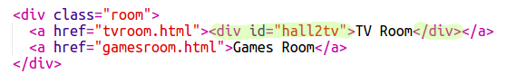
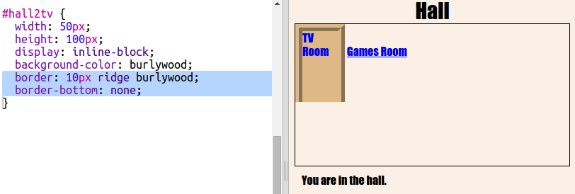

## ಲಿಂಕ್ ಗಳನ್ನು ಬಾಗಿಲುಗಳ ಹಾಗೆ ಕಾಣುವಂತೆ ಮಾಡಿ

ಲಿಂಕ್‌ಗಳು ಕೇವಲ ಪಠ್ಯವಾಗಿರಬೇಕಾಗಿಲ್ಲ. `
` ಬಳಸಿ ಕ್ಲಿಕ್ ಮಾಡಬಹುದಾದ ಬಾಗಿಲು ಮಾಡೋಣ.

+ `index.html` ತೆರೆಯಿರಿ ಮತ್ತು **TV Room** ಲಿಂಕ್ ಪಠ್ಯಯ ಸುತ್ತಲೂ ಒಂದು `
` ಸೇರಿಸಿ. ಅದನ್ನು ಕ್ಲಿಕ್ ಮಾಡಲು ಅದು `<a>` ಒಳಗೆ ಇರಬೇಕು.
    
    ಹಾಲ್ ನ ಬಾಗಿಲಿನಿಂದ ಟಿವಿ ಕೋಣೆಯನ್ನಾಗಿ ಲೇಬಲ್ ಮಾಡಲು `id="hall2tv"` ಸೇರಿಸಿ ಆದ್ದರಿಂದನೀವು ಬಾಗಿಲನ್ನು ವಿನ್ಯಾಸಗೊಳಿಸಬಹುದು.
    
    

+ `style.css` ಟ್ಯಾಬ್ ಮೇಲೆ ಕ್ಲಿಕ್ ಮಾಡಿ, ಕೆಳಭಾಗಕ್ಕೆ ಹೋಗಿ ಮತ್ತು ಬಾಗಿಲಿನ ಗಾತ್ರ ಮತ್ತು ಬಣ್ಣವನ್ನು ಬದಲಾಯಿಸಲು ಕೆಳಗಿನ CSS ಸೇರಿಸಿ:
    
    

+ ಪಠ್ಯದ ಮೇಲೆ ಮಾತ್ರವಲ್ಲದೆ ಬಾಗಿಲಿನಮೇಲೆ ಎಲ್ಲಿಯಾದರೂ ಕ್ಲಿಕ್ ಮಾಡುವ ಮೂಲಕ ನಿಮ್ಮ ವೆಬ್‌ಪುಟವನ್ನು ಪರೀಕ್ಷಿಸಿ.

+ ಈಗ ಮೂರು ಕಡೆಗಳಲ್ಲಿ ಗಡಿಯನ್ನು ಸೇರಿಸುವ ಮೂಲಕ ಅದನ್ನು ಸ್ವಲ್ಪ ಹೆಚ್ಚು ಬಾಗಿಲಿನಂತೆ ಕಾಣುವಂತೆ ಮಾಡೋಣ:
    
    

+ ಬಾಗಿಲಿನ ಮೇಲಿರುವ ಪಠ್ಯವು ಉತ್ತಮವಾಗಿ ಕಾಣಲು ಕೆಲವು CSS ಅನ್ನು ಸೇರಿಸೋಣ:
    
    

+ ಬಾಗಿಲು ಗಾಳಿಯಲ್ಲಿ ತೇಲುತ್ತಿದೆ ಎಂದು ನೀವು ಬಹುಶಃ ಗಮನಿಸಿದ್ದೀರಿ. ಕೋಣೆಯ ಒಳಗೆ ಬಾಗಿಲನ್ನು ಇರಿಸುವ ಮೂಲಕ ಅದನ್ನು ಸರಿಪಡಿಸೋಣ.
    
    

+ **TV Room** ಗೆ ಹೋಗಲು ಬಾಗಿಲು ಮೇಲೆ ಕ್ಲಿಕ್ ಮಾಡುವ ಮೂಲಕ ನಿಮ್ಮ ವೆಬ್‌ಪುಟವನ್ನು ಪರೀಕ್ಷಿಸಿ.