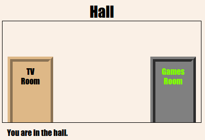

\--- challenge \---

## ಸವಾಲು: ಹೆಚ್ಚಿನ ಬಾಗಿಲುಗಳನ್ನು ಸೇರಿಸಿ!

ನಿಮ್ಮ ಪ್ರಾಜೆಕ್ಟ್‌ನಲ್ಲಿರುವ ಇತರೆ ಲಿಂಕ್‌ಗಳನ್ನು ಅದೇ ರೀತಿಯಲ್ಲಿ ಬಾಗಿಲುಗಳಾಗಿ ಪರಿವರ್ತಿಸಿ.

ಪ್ರತಿಯೊಂದು ಬಾಗಿಲಿಗೆ ನೀವು ಹೀಗೆ ಮಾಡಬೇಕಾಗುತ್ತದೆ:

+ `
` ಜೊತೆಗೆ `hall2games` ನಂತಹ id ಅನ್ನು ತಿದ್ದಲು ಬಾಗಿಲಿನ ಲಿಂಕ್ ಬಳಸಿರಿ, ಆದ್ದರಿಂದ ನೀವು ಅದನ್ನು ವಿನ್ಯಾಸಗೊಳಿಸಬಹುದು.
    
    ಉದಾಹರಣೆಗೆ:
    
    `<a href="gamesroom.html">
Games Room
</a>`

+ ಇದರ ಕೋಣೆಗಾಗಿ `.css` ಫೈಲ್ ಗೆ CSS ಜೊತೆ ಬಾಗಿಲಿನ ID ಯನ್ನು ಸೇರಿಸಿ. ಸಮಯವನ್ನು ಉಳಿಸಲು *copy* ಮತ್ತು *paste* ಉಪಯೋಗಿಸಿ. ನೀವು ಬಯಸಿದರೆ ಪ್ರತಿ ಬಾಗಿಲು ವಿಭಿನ್ನವಾಗಿ ಕಾಣುವಂತೆ ಮಾಡಬಹುದು.

+ `bottom:` ಮತ್ತು `left:` ಅಥವಾ `right:` ಗಳನ್ನು ಬಳಸಿ ಬಾಗಿಲನ್ನು ಇರಿಸಿ.

ಹಾಲ್ ಈ ರೀತಿ ಕಾಣಿಸಬಹುದು:

ಟಿವಿ ರೂಮ್ ಒಟ್ಟಾರೆ ಈ ರೀತಿಯಾಗಿ ಕಾಣಬೇಕು:

\--- /challenge \---