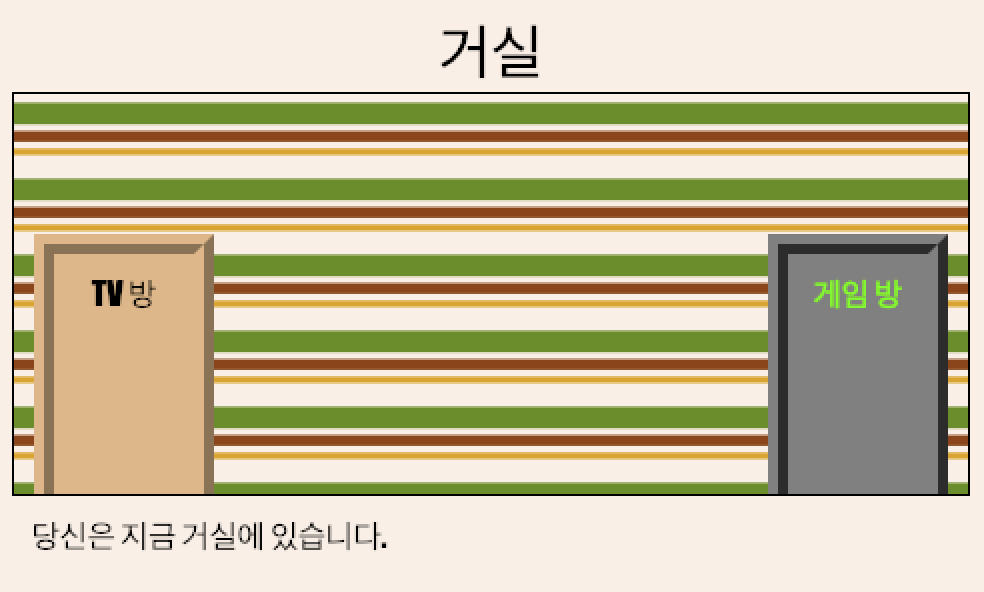

## 소개

이 프로젝트에서는 각각의 HTML로 구성된 여러 개의 방을 만들어, 하이퍼링크로 여러 방을 연결하는 사이트를 제작해 봅니다.

  <iframe src="https://trinket.io/embed/html/d230034fc4?outputOnly=true&start=result" width="600" height="450" frameborder="0" marginwidth="0" marginheight="0" allowfullscreen>
  </iframe>
  

**도움말**: 문을 클릭해서 방 사이를 이동해 보세요.

### 교육자들을 위한 추가 정보

이 프로젝트를 인쇄하려면 [프린트용 문서](https://projects.raspberrypi.org/ko-KR/projects/linked-rooms/print)를 사용하십시오.

--- collapse ---
---
title: 교육자 노트
---

## 소개

이 프로젝트에서 학생들은 자신이 제작한 CSS 파일을 사용하여 동일한 프로젝트 내 여러 페이지에 디자인을 반영하게 됩니다.

## 온라인 자료

이 자료에서는 [Trinket](https://trinket.io/)을 사용하여 HTML & CSS를 온라인으로 편집할 것을 권장합니다. 이 프로젝트에 포함된 Trinket은 다음과 같습니다:

+ ['연결된 방' 시작점 - jumpto.cc/webrooms](http://jumpto.cc/web-rooms)

학생들은 새로운 Trinket[(jumpto.cc/html-black)](http://jumpto.cc/html-blank)을 사용할 수 있으며, 이를 통해 자신만의 HTML & CSS 코드를 작성하는 법을 배울 수 있습니다. 또한, 템플릿이 제공되어 있는 Trinket을 사용할 수 있습니다. [(jumpto.cc/html-template)](http://jumpto.cc/html-template).

프로젝트의 샘플 정답이 다음 Trinket 에 있습니다.

+ ['연결된 방' 완성된 프로젝트- https://trinket.io/html/ba5d27ec68](https://trinket.io/html/d230034fc4)

## 오프라인 자료들

여러분의 선호에 따라 프로젝트를 [오프라인에서 완성](https://www.codeclubprojects.org/en-GB/resources/webdev-working-offline/)할 수 있습니다. 'Project Materials' 라는 링크를 클릭하여 이 프로젝트의 자료를 확인해 볼 수 있습니다. 이 링크에는 학생들이 프로젝트를 오프라인으로 완료하는 데 필요한 자료가 포함된 'Project Resource' 섹션이 있습니다. 학생들이 이러한 자료의 사본에 접근할 수 있는지 확인하십시오. 이 섹션에는 아래와 같은 파일들이 포함되어 있습니다.

+ linked-rooms/index.html
+ linked-rooms/style.css
+ linked-rooms/script.js
+ linked-rooms/prefixfree.js
+ linked-rooms/4 x .png images
+ template/template.html
+ template/style.css

이 프로젝트의 완성된 버전은 'Volunteer Resources' 섹션에서 찾을 수 있습니다. 다음 파일이 있습니다:

+ linked-rooms-finished/index.html
+ linked-rooms-finished/style.css
+ linked-rooms-finished/script.js
+ linked-rooms-finished/prefixfree.js
+ linked-rooms-finished/4 x .png images

(또한 위의 모든 자료는 프로젝트 및 자원봉사자 `.zip` 파일로 다운로드 할 수 있습니다.)

## 학습 목표

+ 여러 html 페이지가 함께 연결되어 있는 프로젝트를 제작합니다.
+ 여러 CSS 파일이 연결되어 있는 프로젝트를 제작합니다.

이 프로젝트는 [라즈베리파이 디지털 메이킹 커리큘럼](http://rpf.io/curriculum) 중 아래의 과정에 있는 요소들을 다룹니다.

+ [2D와 3D 디자인](https://www.raspberrypi.org/curriculum/design/creator)

## 도전과제

+ "다른 링크 추가"- 동일한 프로젝트의 페이지들 사이에 링크를 추가하십시오.
+ "방에 스타일과 링크 추가하기"- 링크를 추가하고 자체 CSS 파일로 페이지 스타일을 지정하십시오. 
+ "더 많은 문 추가!"- 사용 
 를 클릭할 수 있는 링크로 추가하기 
+ "게임 내 방에 배경화면 추가" - 배경 이미지 추가 
+ "자신의 방으로 만들기!" - 배운 기술을 활용해 더 많은 방 추가하기 
+ "키 커서 추가하기" - 프로젝트를 완료한 사람들은 재미있는 옵션을 추가해 보기

-- /collapse ---

--- collapse ---
---
title: 프로젝트 자료
---

## 프로젝트 리소스

* [프로젝트의 모든 리소스가 들어있는 .zip 파일](resources/rooms-project-resources.zip)
* [모든 '연결된 방'프로젝트 자원을 포함하는 온라인 장신구](http://jumpto.cc/web-rooms)
* [온라인 Trinket 템플릿](http://jumpto.cc/trinket-template)
* [빈 Trinket](http://jumpto.cc/trinket-blank)
* [template/index.html](resources/template-index.html)
* [template/style.css](resources/template-style.css)
* [linked-rooms/index.html](resources/linked-rooms-index.html)
* [linked-rooms/style.css](resources/linked-rooms-style.css)
* [linked-rooms/tvroom.html](resources/linked-rooms-tvroom.html)
* [linked-rooms/tvroom.css](resources/linked-rooms-tvroom.css)
* [linked-rooms/wallpaper.png](resources/linked-rooms-wallpaper.png)
* [linked-rooms/space-invader.png](resources/linked-rooms-space-invader.png)
* [linked-rooms/tiles.png](resources/linked-rooms-tiles.png)
* [linked-rooms/star.png](resources/linked-rooms-star.png)
* [linked-rooms/stripes.png](resources/linked-rooms-stripes.png)

## 교육자를 위한 자료

* [완성된 모든 프로젝트 리소스가 들어있는 .zip 파일](resources/rooms-volunteer-resources.zip)
* [완성된 온라인 Trinket 프로젝트](https://trinket.io/html/d230034fc4)
* [linked-rooms-finished/index.html](resources/linked-rooms-finished-index.html)
* [linked-rooms-finished/style.css](resources/linked-rooms-finished-style.css)
* [linked-rooms-finished/tvroom.html](resources/linked-rooms-finished-tvroom.html)
* [linked-rooms-finished/tvroom.css](resources/linked-rooms-finished-tvroom.css)
* [linked-rooms-finished/gamesroom.html](resources/linked-rooms-finished-gamesroom.html)
* [linked-rooms-finished/gamesroom.css](resources/linked-rooms-finished-gamesroom.css)
* [linked-rooms-finished/wallpaper.png](resources/linked-rooms-finished-wallpaper.png)
* [linked-rooms-finished/space-invader.png](resources/linked-rooms-finished-space-invader.png)
* [linked-rooms-finished/tiles.png](resources/linked-rooms-finished-tiles.png)
* [linked-rooms-finished/star.png](resources/linked-rooms-finished-star.png)
* [linked-rooms-finished/stripes.png](resources/linked-rooms-finished-stripes.png)

--- /collapse ---