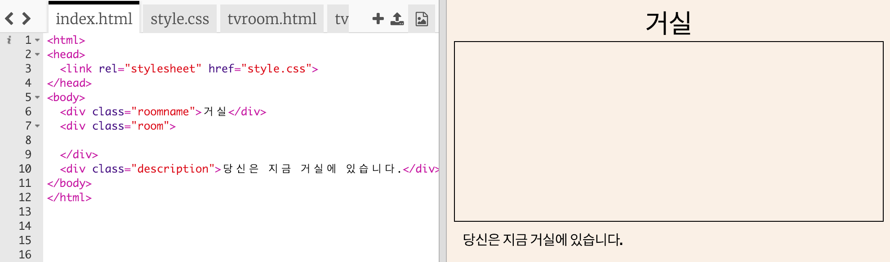
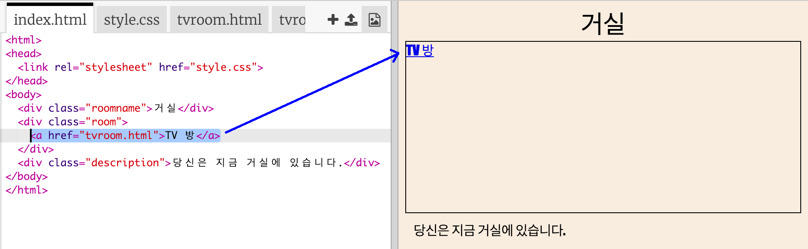

## 동일한 프로젝트의 다른 웹 페이지에 링크하기

웹 프로젝트는 서로 연결된 많은 HTML 파일로 구성됩니다.

+ 다음 Trinket 파일을 열어주세요. <a href="https://trinket.io/html/63276e36a8" target="_blank">jumpto.cc/web-rooms</a>.
    
    Trinket을 열면 아래와 같은 프로젝트가 보일 것입니다.
    
    

+ Trinket 은 자동 실행되어야 하며, 처음 시작은 index 파일이 위치한 거실에서 시작할 것입니다.
    
    

+ 파일 탭 목록을 보세요. `tvroom.html` 파일을 찾을 수 있나요? 파일을 클릭하세요.
    
    
    
    이 파일은 동일한 프로젝트의 또 다른 html 파일입니다.

+ `tvroom.html` 파일에 접근하기 위해서는 `index.html` 파일에 하이퍼링크를 추가해야 합니다.
    
    그림에 강조된 코드를 `
` 안 `room` 클래스 안에 설정합니다.
    
    

+ **TV Room** 링크를 클릭하여 `tvroom.html` 웹 페이지에 정상적으로 들어가지는지 확인하십시오.
    
    `tvroom.html` 에는 페이지의 레이아웃을 정의하는 `tvroom.css` 스타일 파일도 있습니다.
    
    