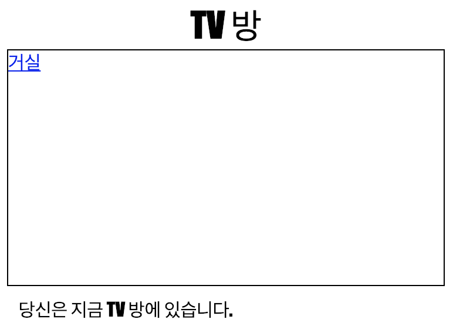

\--- challenge \---

## 과제: 새로운 링크 추가하기

`tvroom.html` 웹 페이지에 `<a>` 태그를 추가하여 `index.html`, 거실 웹 페이지로 다시 돌아올 수 있도록 합니다. 링크 텍스트는 '거실' 이어야 합니다.

TV 방 웹페이지에는 아래와 같이 클릭 가능한 링크가 있어야 합니다.

코드가 정상 작동하는지 확인하십시오. 거실 웹페이지에서 TV 방 웹페이지로 이동하고, 다시 거실로 되돌아 갈 수 있어야 합니다.

\--- /challenge \---