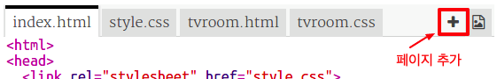
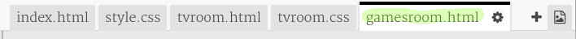
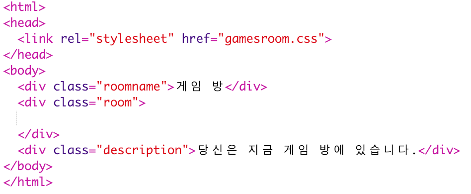
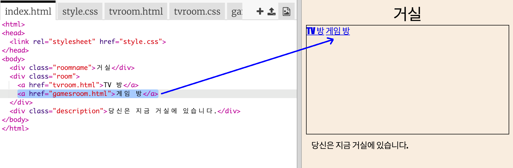
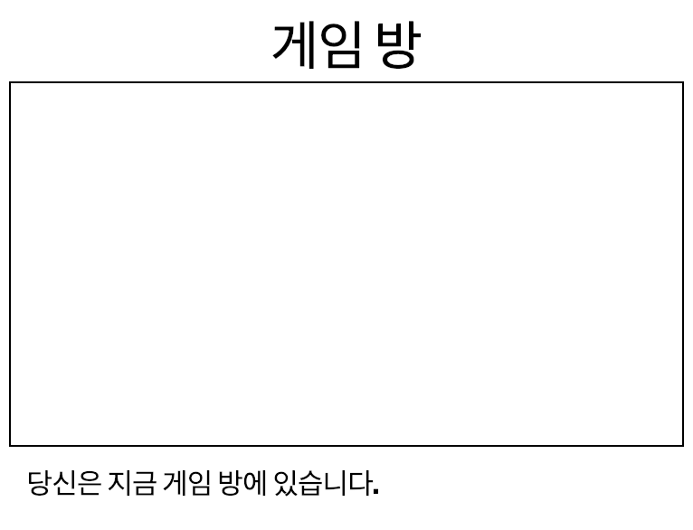

## 다른 방 만들기

이제, **게임 방** 을 새롭게 추가해보도록 하겠습니다.

+ **+** 버튼을 눌러 페이지를 추가하십시오:
    
    
    
    `gamesroom.html` 을 페이지 이름으로 입력하세요.
    
    

+ **게임 방** 의 HTML 코드는 `tvroom.html` 의 코드와 매우 비슷하니, 해당 코드를 `gamesroom.html` 에 **복사**, **붙여넣기** 하세요.
    
    TV라고 되어 있는 글자를 게임이라고 수정합니다.
    
    

+ `gamesroom.html` 은 아직 존재하지 않는 `gamesroom.css` 을 사용합니다.
    
    **+** 버튼을 눌러 `gamesroom.css` 을 새롭게 만듭니다.

+ **게임 방** 의 CSS 코드는 `tvroom.css` 의 코드와 매우 비슷하니, 해당 코드를 `gamesroom.css` 에 **복사**, **붙여넣기** 하세요.
    
    

+ 거실에 게임 방 링크를 추가하세요:
    
    

+ 게임 방 링크를 클릭하여 프로젝트를 테스트하십시오.
    
    **게임 방** 은 아래 이미지와 같아야 합니다.
    
    
    
    아직은 게임 방이 밋밋해 보이는데, 다음 챕터에서 이 문제를 해결할 수 있습니다.