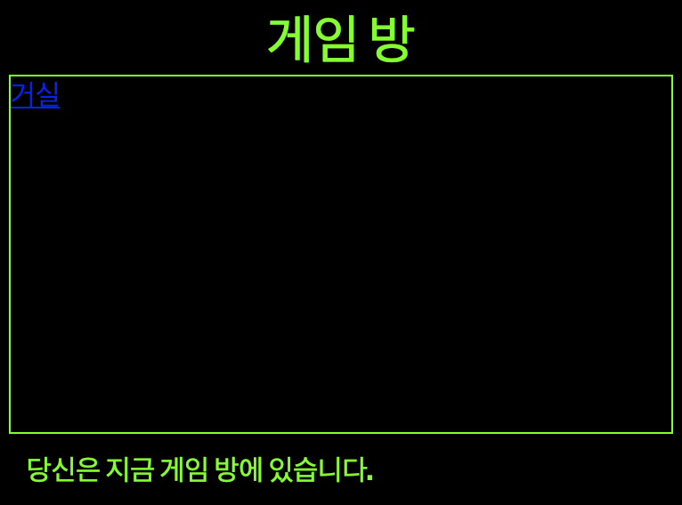

--- challenge ---

## 과제: 게임 룸 스타일 및 링크 설정하기

**게임 방** 의 HTML 및 CSS 를 편집하여 웹 페이지가 다음과 같이 보이도록 제작하십시오:

힌트: `gamesroom.css` 에서 배경색 (background color), 글꼴 색 (font colour) 및 테두리 색 (border colour)을 변경해야 합니다. 밝은 초록색을 `chartreuse` 이라고 합니다.

힌트 : `gamesroom.html` 에 `index.html`, 거실로 링크 된 `<a>` 링크를 추가해야 합니다.

--- /challenge ---