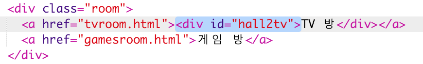
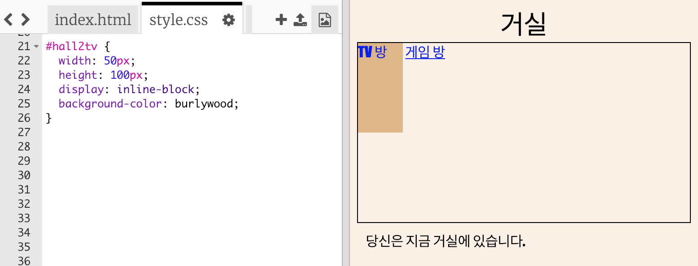
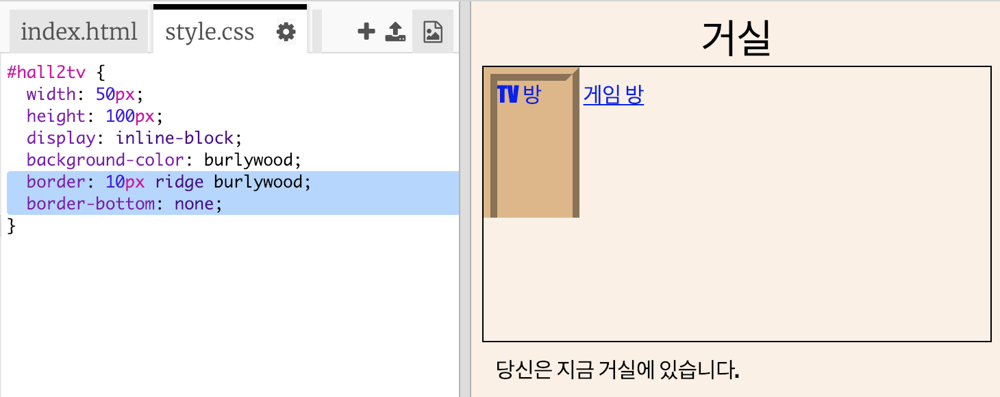
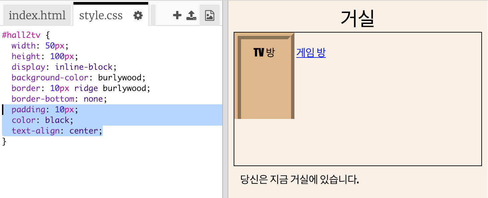
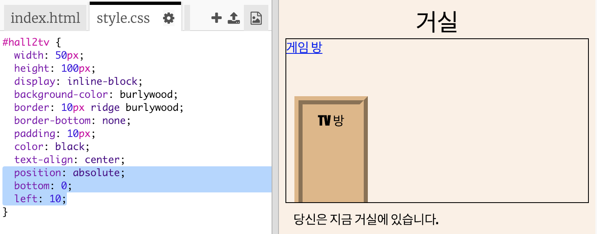

## 링크를 문처럼 보이게 만들기

링크는 꼭 텍스트로만 할 필요가 없습니다. `
` 를 사용하여 문을 클릭 가능하게 만들어 봅시다.

+ `index.html` 열고 **TV 방** 링크 텍스트 주위에 `
` 를 추가하십시오. 클릭할 수 있게 하려면 텍스트가 `<a>` 안에 있어야 합니다.
    
    `id = "hall2tv"` 를 추가하고, 거실에서 TV 룸으로 이동하는 문으로 라벨링을 설정하는 등 문을 스타일링 할 수 있습니다.
    
    

+ `style.css` 탭을 클릭하고 하단으로 이동하여 아래 CSS 코드를 추가하여, 문의 크기와 색상을 변경합니다:
    
    

+ 텍스트 뿐만이 아닌 문도 클릭하여 웹 페이지를 테스트 하세요.

+ 이제 문에 테두리를 추가하여 최대한 문과 비슷하게 보이도록 만들어 봅시다.
    
    

+ 그리고 텍스트 배치를 CSS에서 설정해 더 보기 좋게 만들어 봅시다.
    
    

+ 문이 공중에 떠있는 게 뭔가 이상하죠? 방 안쪽에 문이 있도록 포지션을 변경하여 문제를 해결합시다.
    
    

+ 문을 클릭하여 **TV Room** 이동하여 웹 페이지를 테스트하십시오.