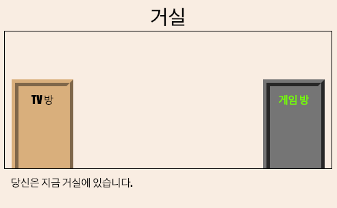
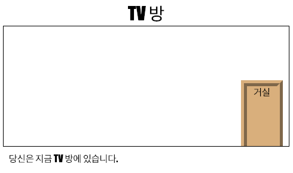

--- challenge ---

## 과제: 더 많은 문 만들기!

프로젝트의 다른 페이지로 연결하기 위한 문을 제작하는 방법도 아까 사용했던 방법과 동일합니다.

각 문마다 다음 과정을 수행해야 합니다:

+ `hall2games` 와 같은 ID로 `
` 를 사용하여 스타일을 지정할 수 있습니다.
    
    예를 들면:
    
    `<a href="gamesroom.html">
게임 방
</a>`

+ 해당 문에 대한 `.css` 파일을 추가합니다. _copy_ 과 _paste_ 를 사용하여 시간을 절약하십시오. 원하는 경우 각 문을 다르게 표시 할 수 있습니다.

+ `bottom:`, `left:`, `right:` 를 사용하여 도어를 배치합니다.

거실은 다음과 같이 보일 것입니다.

TV 방은 다음과 같이 보일 것입니다:

--- /challenge ---