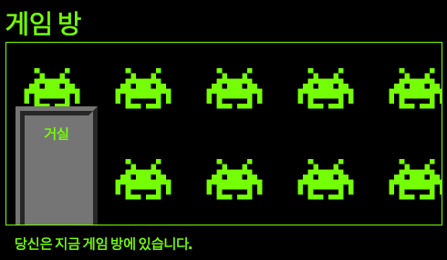

\--- challenge \---

## 과제: 게임 방에 벽지 추가하기

게임 방을 배경 이미지로 꾸밀 수 있나요?

프로젝트에 포함되어있는 `space-invader.png` 배경 이미지를 사용할 수 있습니다.

아래와 같은 작업이 필요합니다:

+ `background-image:`를 게임 방에 해당하는 `.room` CSS ID에 추가합니다. 

게임 방 은 아래 이미지와 같아야 합니다.

\--- /challenge \---