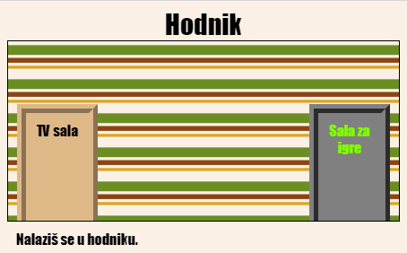

## Uvod

U ovom projektu napravićeš više povezanih prostorija, a svaka prostorija biće zasebna veb-stranica koju ćeš moći da ukrasiš koristeći HTML.

  <iframe src="https://trinket.io/embed/html/eab49f4f06?outputOnly=true&start=result" width="600" height="450" frameborder="0" marginwidth="0" marginheight="0" allowfullscreen>
  </iframe>
  

**Uputstvo**: Klikni na vrata da pređeš iz jedne prostorije u drugu.

### Dodatne informacije za vođe kluba

Ukoliko je potrebno da odštampate ovaj projekat, koristite [Verziju za štampu](https://projects.raspberrypi.org/en/projects/linked-rooms/print).

## \--- collapse \---

## title: Bilješke za vođe kluba

## Uvod:

U ovom projektu djeca se upoznaju sa više veb-stranica povezanih u istom projektu, od kojih svaka ima sopstvenu CSS datoteku.

## Online izvori

Za pisanje HTML-a i CSS-a online preporučujemo da koristite [trinket](https://trinket.io/). Ovaj projekat sadrži sljedeći trinket:

* [Početak projekta 'Povezane prostorije' -- jumpto.cc/web-rooms](https://trinket.io/html/f1486ddb24)

Za pisanje sopstvenog HTML-a i CSS-a, djeca takođe mogu da koriste ovaj prazan trinket [(jumpto.cc/html-blank)](http://jumpto.cc/html-blank) ili da koriste ovaj trinket šablon [(jumpto.cc/html-template)](http://jumpto.cc/html-template).

Takođe postoji trinket koji sadrži primjer rješenja izazova:

* [Završen projekat 'Povezane prostorije' -- https://trinket.io/html/ba5d27ec68](https://trinket.io/html/eab49f4f06)

## Offline izvori

Ako želite, ovaj projekat može biti [izrađen offline](https://www.codeclubprojects.org/en-GB/resources/webdev-working-offline/). Izvorima projekta možete pristupiti klikom na link projekta 'Projektni materijali'. Navedeni link sadrži odjeljak 'Izvori projekta' u kojem se nalaze izvori koji će djeci biti potrebni kako bi izradila ovaj projekat offline. Obezbijedite da svako dijete ima pristup kopiji ovih izvora. Odjeljak sadrži sljedeće datoteke:

* linked-rooms/index.html
* linked-rooms/style.css
* linked-rooms/script.js
* linked-rooms/prefixfree.js
* linked-rooms/4 x .png images
* template/template.html
* template/style.css

Takođe, završenu verziju izazova ovoga projekta možete naći u odjeljku 'Izvori za volontere' koji sadrži:

* linked-rooms-finished/index.html
* linked-rooms-finished/style.css
* linked-rooms-finished/script.js
* linked-rooms-finished/prefixfree.js
* linked-rooms-finished/4 x .png images

(Sve navedene izvore moguće je preuzeti kao `.zip` datoteke.)

## Ciljevi učenja

* Ovaj projekat je uvod u projekte sa više međusobno povezanih html stranica
* Takođe je predstavljeno više CSS datoteka

Ovim projektom obuhvaćeni su elementi iz sljedećih dijelova [Raspberry Pi Digital Making Curriculum](http://rpf.io/curriculum):

* [Dizajniranje osnovnih 2D i 3D elemenata](https://www.raspberrypi.org/curriculum/design/creator).

## Izazovi

* ''Dodaj još jedan link'' - Dodaj link između stranica u istom projektu
* ''Stilizuj i poveži Salu za igre'' - Dodaj link i stilizuj stranicu sa sopstvenom CSS datotekom 
* ''Dodaj više vrata!'' - Koristi 

<

div>s kao klikabilne linkove + "Dodaj tapet Sali za igre" - Dodaj pozadinsku sliku + "Uradi to na svoj način!" - Dodaj još prostorija koristeći stečene vještine + "Dodaj kursor u obliku ključa " - Zabavan neobavezan dodatak za one koji završe projekat

\--- /collapse \---

## \--- collapse \---

## title: Projektni materijali

## Izvori projekta

* [.zip datoteka koja sadrži sve izvore projekta](resources/rooms-project-resources.zip)
* [Online Trinket koji sadrži sve izvore projekta 'Povezane prostorije'](http://jumpto.cc/web-rooms)
* [Online Trinket šablon](http://jumpto.cc/trinket-template)
* [Online prazan Trinket](http://jumpto.cc/trinket-blank)
* [template/index.html](resources/template-index.html)
* [template/style.css](resources/template-style.css)
* [linked-rooms/index.html](resources/linked-rooms-index.html)
* [linked-rooms/style.css](resources/linked-rooms-style.css)
* [linked-rooms/tvroom.html](resources/linked-rooms-tvroom.html)
* [linked-rooms/tvroom.css](resources/linked-rooms-tvroom.css)
* [linked-rooms/wallpaper.png](resources/linked-rooms-wallpaper.png)
* [linked-rooms/space-invader.png](resources/linked-rooms-space-invader.png)
* [linked-rooms/tiles.png](resources/linked-rooms-tiles.png)
* [linked-rooms/star.png](resources/linked-rooms-star.png)
* [linked-rooms/stripes.png](resources/linked-rooms-stripes.png)

## Izvori za vođe kluba

* [.zip datoteka koja sadrži sve završene izvore projekta](resources/rooms-volunteer-resources.zip)
* [Završen Trinket projekat online](https://trinket.io/html/eab49f4f06)
* [linked-rooms-finished/index.html](resources/linked-rooms-finished-index.html)
* [linked-rooms-finished/style.css](resources/linked-rooms-finished-style.css)
* [linked-rooms-finished/tvroom.html](resources/linked-rooms-finished-tvroom.html)
* [linked-rooms-finished/tvroom.css](resources/linked-rooms-finished-tvroom.css)
* [linked-rooms-finished/gamesroom.html](resources/linked-rooms-finished-gamesroom.html)
* [linked-rooms-finished/gamesroom.css](resources/linked-rooms-finished-gamesroom.css)
* [linked-rooms-finished/wallpaper.png](resources/linked-rooms-finished-wallpaper.png)
* [linked-rooms-finished/space-invader.png](resources/linked-rooms-finished-space-invader.png)
* [linked-rooms-finished/tiles.png](resources/linked-rooms-finished-tiles.png)
* [linked-rooms-finished/star.png](resources/linked-rooms-finished-star.png)
* [linked-rooms-finished/stripes.png](resources/linked-rooms-finished-stripes.png)

\--- /collapse \---