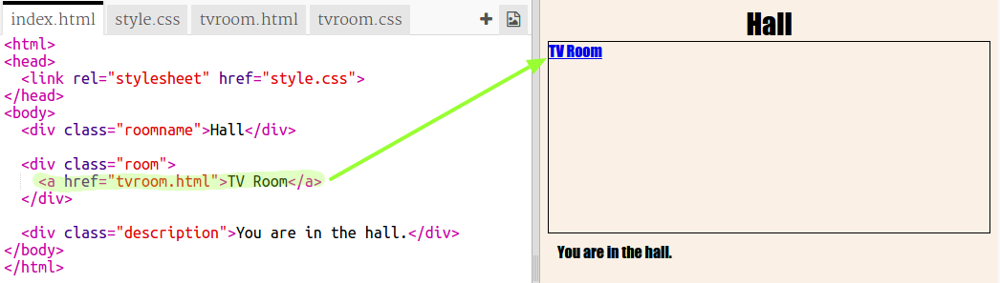
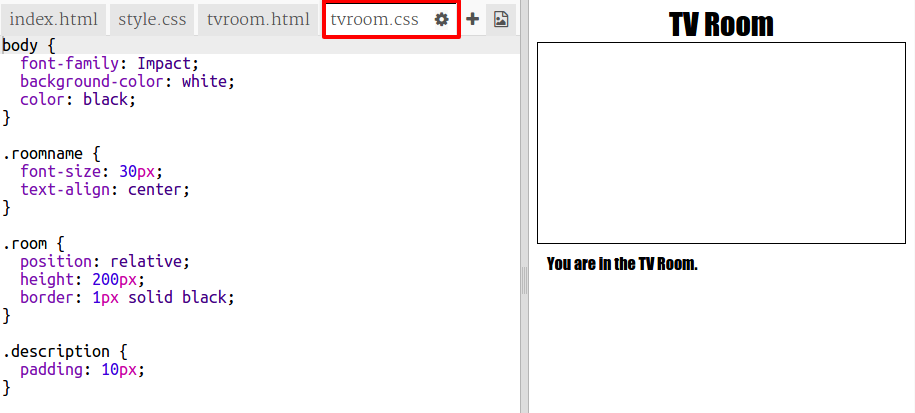

## Povezivanje sa drugom veb-stranicom u istom projektu

Veb-projekti mogu da budu sačinjeni od više međusobno povezanih HTML datoteka.

+ Otvori sljedeći trinket: <a href="http://trinket.io/html/1b8571670a" target="_blank">trinket.io/html/1b8571670a</a>.
    
    Projekat treba da izgleda ovako:
    
    

+ Trinket će se automatski pokrenuti i naći ćeš se u hodniku:
    
    

+ Pogledaj spisak kartica za datoteke u ovom trinketu. Da li vidiš karticu `tvroom.html`? Klikni na nju.
    
    
    
    Ovo je još jedna html datoteka u istom projektu.

+ Za prelazak u `tvroom.html` potrebno je da dodaš link u `index.html`.
    
    Dodaj označeni kôd unutar `
` sa klasom `room`:
    
    

+ Isprobaj svoj trinket tako što ćeš kliknuti na link **TV sala** da bi vidio/vidjela veb-stranicu `tvroom.html`.
    
    Imaj u vidu da `tvroom.html` takođe ima svoju datoteku stila `tvroom.css` koji definiše izgled ove stranice.
    
    