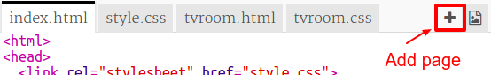
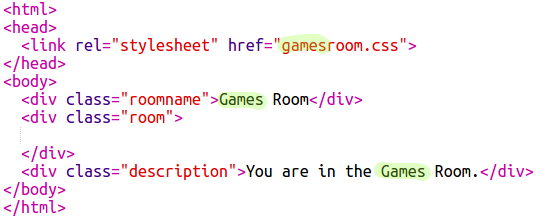
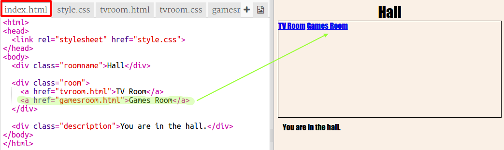

## Dodaj još jednu salu

Dodajmo sada još jednu salu, **Salu za igre**.

+ Klikni na dugme **+** za dodavanje stranice:
    
    
    
    Upiši `gamesroom.html` kao naziv stranice:
    
    

+ HTML za **Salu za igre** veoma je sličan `tvroom.html`, pa ga **kopiraj** i **prenesi** u `gamesroom.html`.
    
    Izmijeni označene elemente tako što ćeš umjesto TV upisati 'games' i 'za igre':
    
    

+ Tvoj `gamesroom.html` sada koristi `gamesroom.css` koji još uvijek ne postoji.
    
    Kreiraj `gamesroom.css` tako što ćeš kliknuti na dugme **+** za dodavanje stranice.

+ CSS za **Salu za igre** veoma je sličan `tvroom.css`, pa ga **kopiraj** i **prenesi** u `gamesroom.css`.
    
    

+ U Hodnik dodaj link za Salu za igre:
    
    

+ Isprobaj svoj projekat tako što ćeš kliknuti na link Sale za igre.
    
    **Sala za igre** treba da izgleda ovako:
    
    
    
    Ne izgleda zanimljivo, ali to ćeš moći da popraviš u sljedećem izazovu.