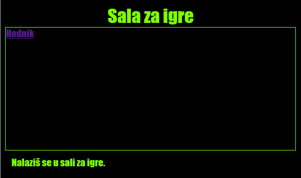

\--- challenge \---

## Izazov: Stilizuj i poveži Salu za igre

Uredi HTML i CSS za **Salu za igre** tako da veb-stranica izgleda ovako:

Savjet: Treba da promijeniš boju pozadine, boju fonta i boju okvira u `gamesroom.css`. Naziv svijetlozelene boje je `chartreuse`.

Hint: You'll need to add an `<a>` link in `gamesroom.html` which links to `index.html`.

\--- /challenge \---