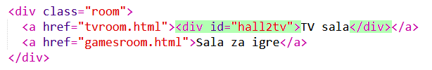
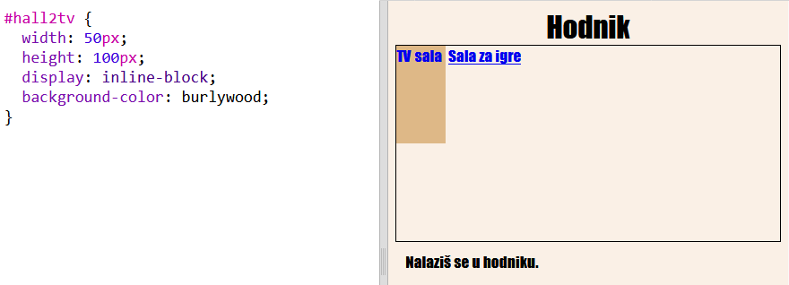
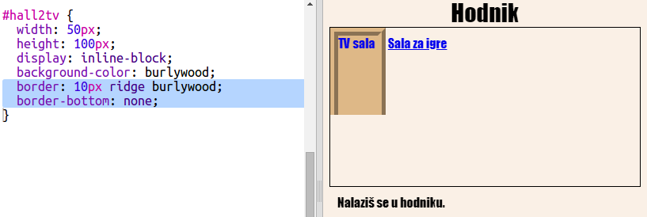
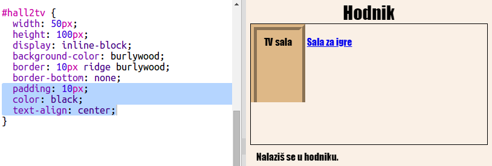
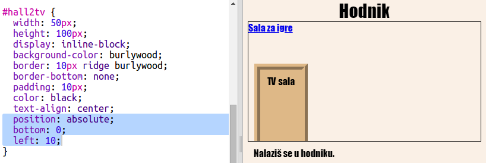

## Napravi da linkovi izgledaju kao vrata

Linkovi ne moraju da budu samo tekst. Napravimo vrata na koja možemo da kliknemo, koristeći `
`.

+ Otvori `index.html` i dodaj `
` oko teksta linka **TV sala**. Mora da bude unutar `<a>` da bismo mogli da kliknemo na njega.
    
    Dodaj `id="hall2tv"` da ga označiš kao vrata koja vode iz hodnika u TV salu, kako bi mogao/mogla da stilizuješ vrata.
    
    

+ Klikni na karticu `style.css`, idi na kraj i dodaj sljedeći CSS da promijeniš veličinu i boju vrata:
    
    

+ Isprobaj svoju veb-stranicu tako što ćeš kliknuti na bilo koji dio vrata, ne samo na tekst.

+ Sada poboljšajmo izgled vrata tako što ćemo dodati okvir sa tri strane:
    
    

+ I dodajmo još CSS-a kako bi tekst na vratima izgledao ljepše:
    
    

+ Vjerovatno primjećuješ da vrata vise u vazduhu. Popravimo to tako što ćemo postaviti vrata unutar sale.
    
    

+ Isprobaj svoju veb-stranicu tako što ćeš kliknuti na vrata da pređeš u **TV salu**.