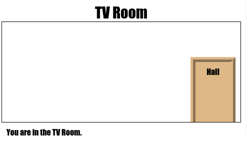

--- challenge ---

## Izazov: Dodaj više vrata!

Na isti način pretvori u vrata ostale linkove u svom projektu.

Za svaka vrata je potrebno da uradiš sljedeće:

+ Uredi link vrata koristeći `
` sa identifikatorom (id) kao što je `hall2games`, tako da možeš da stilizuješ vrata.
    
    Na primjer:
    
    `<a href="gamesroom.html">
Sala za igre
</a>`

+ Dodaj CSS za id vrata u `.css` datoteku prostorije u kojoj su vrata. Koristi *kopiraj* i *prenesi* zbog uštede vremena. Ako želiš, možeš napraviti da svaka vrata izgledaju različito.

+ Odredi položaj vrata koristeći `bottom:` (dolje) i `left:` (lijevo) ili `right:` (desno).

Hodnik može da izgleda ovako:

TV sala bi trebalo da izgleda poput ove:

--- /challenge ---