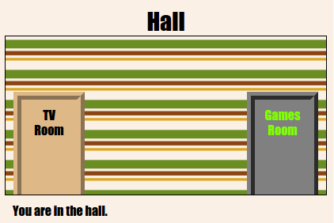

## परिचय

या प्रकल्पात, आपण दुवा साधलेल्या खोल्यांचा एक संच तयार कराल जेथे प्रत्येक खोली एक वेगळा वेब पृष्ठ आहे ज्यास आपण HTML सह सजवू शकता.

  <iframe src="https://trinket.io/embed/html/eab49f4f06?outputOnly=true&start=result" width="600" height="450" frameborder="0" marginwidth="0" marginheight="0" allowfullscreen>
  </iframe>
  

**Instructions**: खोल्यांमध्ये जाण्यासाठी दारे क्लिक करा.

### क्लब प्रमुखांसाठी अधिक माहिती

तुम्हाला जर हा प्रकल्प प्रिंट करायचा असेल तर आपण [प्रिंटर अनुकूल आवृत्ती](https://projects.raspberrypi.org/mr-IN/projects/linked-rooms/print) चा वापर करू शकता.

--- collapse ---
---
title: क्लब प्रमुखांसाठी काही टिपा
---

## परिचय:

या प्रकल्पात, मुलांना त्यांच्या स्वत: च्या CSS फाइलसह समान प्रकल्पातील एकाधिक दुवा साधलेल्या वेब पृष्ठांवर परिचय करुन दिला जातो.

## ऑनलाईन संसाधने

HTML आणि CSS ऑनलाईन लिहिण्याकरता आम्ही [trinket](https://trinket.io/) वापरण्याची शिफारस करतो. या प्रकल्पात पुढील trinket आहे:

* ['Linked rooms' ची सुरवात -- jumpto.cc/web-rooms](https://trinket.io/html/f1486ddb24)

HTMLआणि CSS लिहीण्यासाठी मुले ह्या blank trinket [(jumpto.cc/html-blank)](http://jumpto.cc/html-blank) चाही उपयोग करू शकतात किंवा ते ह्या template trinket [(jumpto.cc/html-template)](http://jumpto.cc/html-template) चाही उपयोग करू शकतात.

आव्हान नमुना उपाय असणारा एक trinket देखील आहे:

* ['दुवा साधलेले खोल्या समाप्त' - https://trinket.io/html/ba5d27ec68](https://trinket.io/html/eab49f4f06)

## ऑफलाइन संसाधने

हा प्रकल्प पसंत असल्यास [ऑफलाइन पूर्ण केला जाऊ शकतो](https://www.codeclubprojects.org/en-GB/resources/webdev-working-offline/). तुम्ही या project resources 'प्रोजेक्ट साहित्य (Project Materials)' लिंक वर​ क्लिक करून मिळवू शकता. या link मध्ये 'Project Resources' विभाग आहे, ज्यामध्ये मुलांना हा प्रकल्प ऑफलाइन पूर्ण करण्यासाठी आवश्यक असणारी संसाधने आहेत. प्रत्येक मुलाकडे ह्याची एक प्रत असेल ह्याची खात्री करा. या विभागात खालील फायली समाविष्ट आहेत:

* linked-rooms/index.html
* linked-rooms/style.css
* linked-rooms/script.js
* linked-rooms/prefixfree.js
* linked-rooms/4 x .png images
* template/template.html
* template/style.css

आपल्याला या प्रकल्पातील challenges पूर्ण आवृत्ती 'Volunteer Resources' विभागात सापडेल, ज्यात हे आहे:

* linked-rooms-finished/index.html
* linked-rooms-finished/style.css
* linked-rooms-finished/script.js
* linked-rooms-finished/prefixfree.js
* linked-rooms-finished/4 x .png images

(वरील सर्व संसाधने प्रकल्प आणि स्वयंसेवक `.zip` फायली म्हणून डाउनलोड करण्यायोग्य देखील आहेत.)

## शिकण्याचे उद्दिष्टे

* या प्रोजेक्टमध्ये एकाधिक html पृष्ठांसह प्रकल्पांचा परिचय आहे
* एकाधिक CSS फायली देखील सादर केल्या आहेत

या प्रकल्पात [Raspberry Pi Digital Making Curriculum](http://rpf.io/curriculum) चे खालील घटक समाविष्ट आहेत:

* [मूलभूत 2D आणि 3D ऍसेटस् डिझाइन करणे](https://www.raspberrypi.org/curriculum/design/creator).

## आव्हाने

* “Add another link” - त्याच प्रकल्पातील पृष्ठांमधील दुवा जोडा;
* “Style and link the Games Room” - एक दुवा जोडा आणि त्याच्या स्वतःच्या CSS फाइलसह पृष्ठ शैली बनवा. 
* “Add more doors!” - वापरा क्लिक करण्यायोग्य दुवे म्हणून 
+ "Add wallpaper to the Games Room" - एक पार्श्वभूमी प्रतिमा जोडा 
+ "Make it yours!" - शिकलेल्या कौशल्यांचा वापर करून आणखी खोल्या जोडा 
+ "Add a key cursor" - प्रकल्प पूर्ण करणार्‍यांसाठी एक मजेदार पर्यायी अतिरिक्त

--- /collapse ---

--- collapse ---
---
title: प्रकल्प साहित्य
---

## प्रकल्प संसाधने

* [सर्व प्रकल्पाची संसाधने असलेली .zip फाइल](https://rpf.io/p/mr-IN/linked-rooms-go)
* [ऑनलाईन Trinket ज्यामध्ये सर्व 'लिंकेड रूम्स' प्रकल्प संसाधने आहेत](http://jumpto.cc/web-rooms)
* [ऑनलाइन Trinket टेम्पलेट](http://jumpto.cc/trinket-template)
* [ऑनलाइन blank Trinket](http://jumpto.cc/trinket-blank)
* [template/index.html](resources/template-index.html)
* [template/style.css](resources/template-style.css)
* [linked-rooms/index.html](resources/linked-rooms-index.html)
* [linked-rooms/style.css](resources/linked-rooms-style.css)
* [linked-rooms/tvroom.html](resources/linked-rooms-tvroom.html)
* [linked-rooms/tvroom.css](resources/linked-rooms-tvroom.css)
* [linked-rooms/wallpaper.png](resources/linked-rooms-wallpaper.png)
* [linked-rooms/space-invader.png](resources/linked-rooms-space-invader.png)
* [linked-rooms/tiles.png](resources/linked-rooms-tiles.png)
* [linked-rooms/star.png](resources/linked-rooms-star.png)
* [linked-rooms/stripes.png](resources/linked-rooms-stripes.png)

## क्लब प्रमुख साठी संसाधने

* [सर्व प्रकल्पाची संसाधने असलेली .zip फाइल](https://rpf.io/p/mr-IN/linked-rooms-go)
* [ऑनलाइन पूर्ण झालेले Trinket प्रोजेक्ट](https://trinket.io/html/eab49f4f06)
* [linked-rooms-finished/index.html](resources/linked-rooms-finished-index.html)
* [linked-rooms-finished/style.css](resources/linked-rooms-finished-style.css)
* [linked-rooms-finished/tvroom.html](resources/linked-rooms-finished-tvroom.html)
* [linked-rooms-finished/tvroom.css](resources/linked-rooms-finished-tvroom.css)
* [linked-rooms-finished/gamesroom.html](resources/linked-rooms-finished-gamesroom.html)
* [linked-rooms-finished/gamesroom.css](resources/linked-rooms-finished-gamesroom.css)
* [linked-rooms-finished/wallpaper.png](resources/linked-rooms-finished-wallpaper.png)
* [linked-rooms-finished/space-invader.png](resources/linked-rooms-finished-space-invader.png)
* [linked-rooms-finished/tiles.png](resources/linked-rooms-finished-tiles.png)
* [linked-rooms-finished/star.png](resources/linked-rooms-finished-star.png)
* [linked-rooms-finished/stripes.png](resources/linked-rooms-finished-stripes.png)

--- /collapse ---