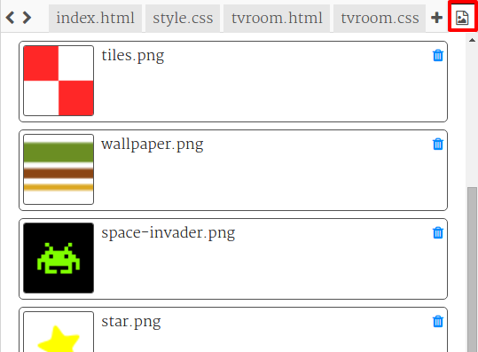

\--- challenge \---

## आव्हान: आपले बनवा!

आपल्या प्रकल्पात अधिक खोल्या जोडा. लक्षात ठेवा आपण **copy** आणि **paste** वापर करू शकता वेळ वाचविण्यासाठी आणि नंतर त्या गोष्टी बदलू ज्या भिन्न असणे आवश्यक आहे.

प्रत्येक दरवाजासाठी आपल्याला हे आवश्यक आहे:

+ एक `.html` फाईल तयार करा
+ नवीन 'room' मध्ये आणि त्यापासून दरवाजाचे दुवे जोडा
+ एक `.css` तयार करा आपल्या नवीन खोलीसाठी आणि त्याच्या दारासाठी शैलीसह फाइल करा

आपण प्रत्येक खोलीसाठी `background-color:` बदलू शकता. आपण निवडू शकता त्या पार्श्वभूमी प्रतिमा पाहण्यासाठी images icon वर क्लिक करा:

\--- /challenge \---