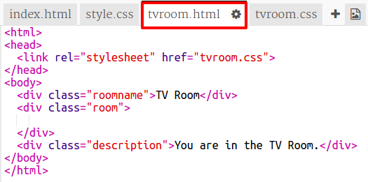

## त्याच प्रकल्पातील दुसर्‍या वेब पृष्ठाशी दुवा साधत आहे

वेब प्रोजेक्ट एकत्र जोडलेल्या बर्‍याच HTML फायलींचे बनलेले असू शकतात.

+ हा trinket उघडा: <a href="https://trinket.io/html/f1486ddb24" target="_blank">jumpto.cc/web-rooms</a>.
    
    प्रकल्प असा दिसायला हवा:
    
    

+ Trinket ने ऑटोरन केले पाहिजे आणि आपल्याला स्वतःस हॉलमध्ये आढळेल:
    
    

+ या trinket साठी file tabs ची यादी पहा. आपण `tvroom.html` पाहू शकता? त्यावर क्लिक करा.
    
    
    
    याच प्रकल्पातील ही आणखी एक html फाईल आहे.

+ `tvroom.html` वर जाण्यासाठी आपल्याला `index.html` मध्ये दुवा जोडण्याची आवश्यकता आहे.
    
    `
` वर्गात `room` सह हायलाइट केलेला कोड जोडा:
    
    

+ **TV Room** वर क्लिक करून आपल्या trinket ची चाचणी घ्या `tvroom.html` पाहण्यासाठी दुवा वेब पृष्ठ.
    
    लक्षात घ्या की `tvroom.html` मध्ये स्वतःची `tvroom.css` शैली फाइल देखील आहे जी या पृष्ठासाठी लेआउट परिभाषित करते.
    
    