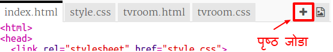
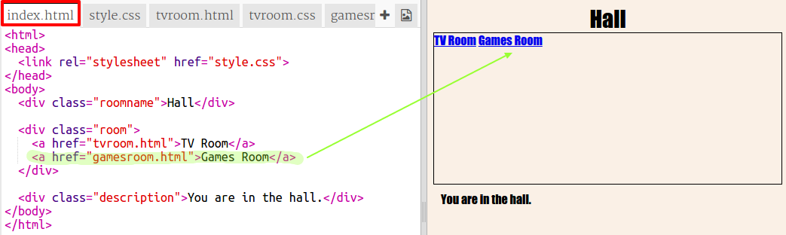

## आणखी एक खोली जोडा

चला आणखी एक खोली जोडू, एक ** Games Room**.

+ अ‍ॅड पेज **+** बटणावर क्लिक करा:
    
    
    
    पृष्ठाचे नाव म्हणून `gamesroom.html` टाइप करा:
    
    

+ **Games Room** साठी HTML `tvroom.html` प्रमाणेच आहे, म्हणून ते **copy** करा आणि `gamesroom.html` त्या कोडमध्ये **paste** करा.
    
    हायलाइट केलेले आयटम संपादित करा जेणेकरून ते TV नाही Games असे म्हणतील:
    
    

+ आपले ` gamesroom.html ` आता ` gamesroom.css ` वापरते जे अद्याप अस्तित्वात नाही.
    
    अ‍ॅड पेज **+** वर क्लिक करा ` gamesroom.css ` तयार करा.

+ **Games Room** साठीचा CSS `tvroom.css` प्रमाणेच आहे, म्हणून **copy** करा आणि त्या `gamesroom.css` कोडमध्ये **paste** करा.
    
    

+ Hall मधून Games room मध्ये दुवा जोडा:
    
    

+ Games room दुव्यावर क्लिक करून आपल्या प्रोजेक्टची चाचणी घ्या
    
    **Games Room** यासारखे दिसले पाहिजे:
    
    
    
    खूप रोमांचक नाही, परंतु आपण पुढच्या आव्हानात ते निश्चित करू शकता.