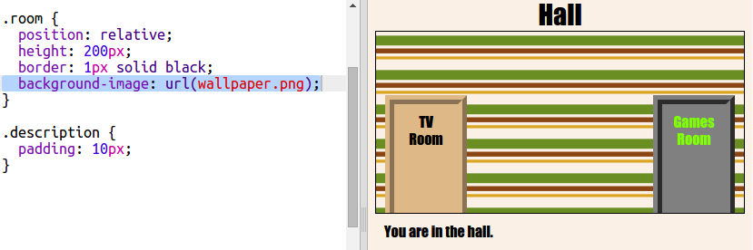

## पार्श्वभूमी प्रतिमा जोडत आहे

चला पार्श्वभूमी प्रतिमेसह Hall सजवू.

+ Hall मध्ये पार्श्वभूमी प्रतिमा जोडण्यासाठी `style.css` संपादित करा:
    
    
    
    संपूर्ण खोली भरण्यासाठी प्रतिमेची पुनरावृत्ती होईल.