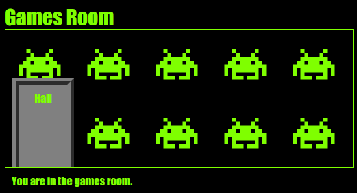

--- challenge ---

## आव्हान: गेम्स रूममध्ये वॉलपेपर जोडा

आपण पार्श्वभूमी प्रतिमेसह games room सजवू शकता?

आपण आपल्या प्रकल्पात समाविष्ट असलेली `space-invader.png` पार्श्वभूमी प्रतिमा वापरू शकता.

तुम्हाला खालील गोष्टी कराव्या लागतील:

+ गेम्स रूमसाठी `.room` CSS मध्ये `background-image:` जोडा. 

Games Room यासारखे दिसले पाहिजे:

--- /challenge ---