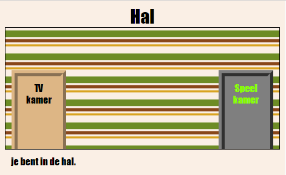

## Invoering

In dit project maak je een reeks gekoppelde kamers waarin elke kamer een andere webpagina is die je kunt versieren met HTML.

  <iframe src="https://trinket.io/embed/html/ba5d27ec68?outputOnly=true&start=result" width="600" height="450" frameborder="0" marginwidth="0" marginheight="0" allowfullscreen>
  </iframe>
  

**Instructies**: klik op de deuren om van kamer te veranderen.

### Aanvullende informatie voor clubleiders

Als u dit project wilt afdrukken, gebruik dan de [Printervriendelijke versie](https://projects.raspberrypi.org/en/projects/linked-rooms/print).

## \--- ineenstorting \---

## titel: Clubleider notities

## Invoering:

In dit project maken kinderen kennis met meerdere gekoppelde webpagina's in hetzelfde project, elk met hun eigen CSS-bestand.

## Online bronnen

We raden aan [trinket](https://trinket.io/) te gebruiken om HTML & CSS online te schrijven. Dit project bevat de volgende trinket:

* ['Linked Rooms'-startpunt - jumpto.cc/web-rooms](http://jumpto.cc/web-rooms)

Kinderen kunnen ook gebruik maken van dit lege trinket [(jumpto.cc/html-blank)](http://jumpto.cc/html-blank) om hun eigen HTML & CSS te schrijven, of ze kunnen deze sjabloontrinket [(jumpto.cc/html-template)](http://jumpto.cc/html-template) gebruiken.

Er is ook een trinket met een voorbeeldoplossing voor de uitdagingen:

* ['Gekoppelde kamers gereed' - https://trinket.io/html/ba5d27ec68](https://trinket.io/html/ba5d27ec68)

## Offline bronnen

Dit project kan [als het offline is](https://www.codeclubprojects.org/en-GB/resources/webdev-working-offline/) zijn voltooid als dit de voorkeur heeft. U kunt toegang krijgen tot de projectbronnen door op de koppeling 'Projectmaterialen' voor dit project te klikken. Deze link bevat een gedeelte 'Projectresources', dat bronnen bevat die kinderen nodig hebben om dit project offline te voltooien. Zorg ervoor dat elk kind toegang heeft tot een kopie van deze bronnen. Dit gedeelte bevat de volgende bestanden:

* linked-kamers / index.html
* linked-kamers / style.css
* linked-kamers / script.js
* linked-kamers / prefixfree.js
* linked-rooms / 4 x .png-afbeeldingen
* template / template.html
* template / style.css

Je kunt ook een voltooide versie van de uitdagingen van dit project vinden in de sectie 'Vrijwilligersbronnen', die bevat:

* gekoppelde-rooms-finished / index.html
* gekoppelde-rooms-finished / style.css
* gekoppelde-rooms-finished / script.js
* gekoppelde-rooms-finished / prefixfree.js
* linked-rooms-finished / 4 x .png-afbeeldingen

(Alle bovenstaande bronnen kunnen ook worden gedownload als project en als vrijwilliger `.zip` bestanden.)

## leerdoelen

* Dit project introduceert projecten met meerdere html-pagina's die aan elkaar zijn gekoppeld
* Er worden ook meerdere CSS-bestanden geïntroduceerd

Dit project behandelt elementen uit de volgende onderdelen van het [Raspberry Pi Digital Making Curriculum](http://rpf.io/curriculum):

* [Ontwerp standaard 2D- en 3D-objecten](https://www.raspberrypi.org/curriculum/design/creator).

## Uitdagingen

* "Voeg nog een link toe" - Voeg een link toe tussen pagina's in hetzelfde project;
* "Style and link the Games Room" - Voeg een link toe en style een pagina met zijn eigen CSS-bestand. 
* "Voeg meer deuren toe!" - Gebruik 

<

div> s als klikbare koppelingen + "Voeg achtergrond toe aan de Spelkamer" - Voeg een achtergrondafbeelding toe + "Maak het van jou!" - Voeg meer kamers toe met behulp van de vaardigheden die u hebt geleerd + "Voeg een sleutelcursor toe" - Een leuke extra optie voor degenen die het project voltooien

\--- / inklappen \---

## \--- ineenstorting \---

## titel: Projectmaterialen

## Project middelen

* [.zip-bestand met alle projectbronnen](resources/rooms-project-resources.zip)
* [Online Trinket met alle projectbronnen van 'Linked Rooms'](http://jumpto.cc/web-rooms)
* [Online Trinket-sjabloon](http://jumpto.cc/trinket-template)
* [Online lege Trinket](http://jumpto.cc/trinket-blank)
* [template / index.html](resources/template-index.html)
* [template / style.css](resources/template-style.css)
* [linked-kamers / index.html](resources/linked-rooms-index.html)
* [linked-kamers / style.css](resources/linked-rooms-style.css)
* [linked-kamers / tvroom.html](resources/linked-rooms-tvroom.html)
* [linked-kamers / tvroom.css](resources/linked-rooms-tvroom.css)
* [linked-kamers / wallpaper.png](resources/linked-rooms-wallpaper.png)
* [linked-kamers / space-invader.png](resources/linked-rooms-space-invader.png)
* [linked-kamers / tiles.png](resources/linked-rooms-tiles.png)
* [linked-kamers / star.png](resources/linked-rooms-star.png)
* [linked-kamers / stripes.png](resources/linked-rooms-stripes.png)

## Club leider middelen

* [.zip-bestand met alle voltooide projectresources](resources/rooms-volunteer-resources.zip)
* [Online voltooid Trinket-project](https://trinket.io/html/1d4d4c5ce1)
* [gekoppelde-rooms-finished / index.html](resources/linked-rooms-finished-index.html)
* [gekoppelde-rooms-finished / style.css](resources/linked-rooms-finished-style.css)
* [gekoppelde-rooms-finished / tvroom.html](resources/linked-rooms-finished-tvroom.html)
* [gekoppelde-rooms-finished / tvroom.css](resources/linked-rooms-finished-tvroom.css)
* [gekoppelde-rooms-finished / gamesroom.html](resources/linked-rooms-finished-gamesroom.html)
* [gekoppelde-rooms-finished / gamesroom.css](resources/linked-rooms-finished-gamesroom.css)
* [gekoppelde-rooms-finished / wallpaper.png](resources/linked-rooms-finished-wallpaper.png)
* [gekoppelde-rooms-afgewerkte / space-invader.png](resources/linked-rooms-finished-space-invader.png)
* [gekoppelde-rooms-finished / tiles.png](resources/linked-rooms-finished-tiles.png)
* [gekoppelde-rooms-finished / star.png](resources/linked-rooms-finished-star.png)
* [gekoppelde-rooms-finished / stripes.png](resources/linked-rooms-finished-stripes.png)

\--- / inklappen \---