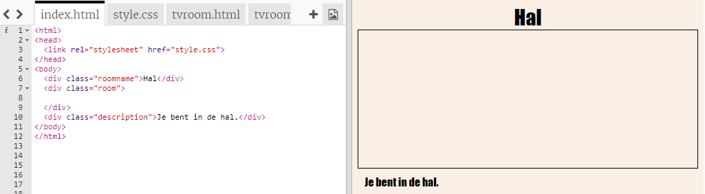
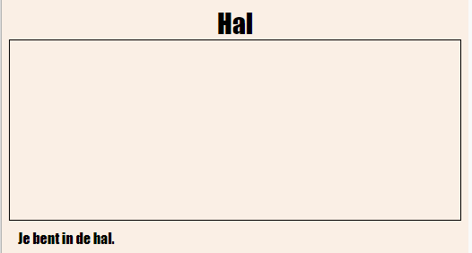
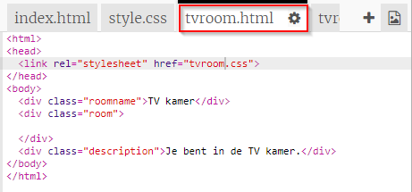
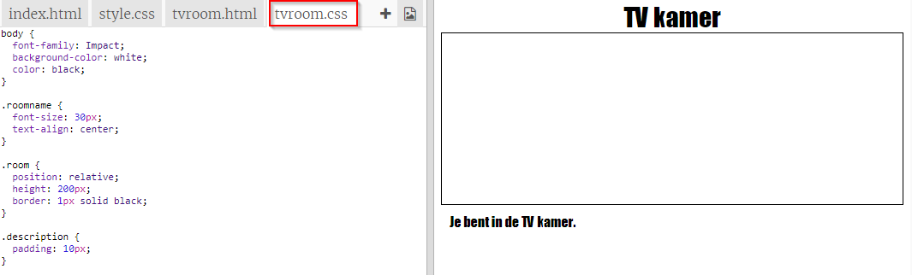

## Naar een andere webpagina in hetzelfde project linken (koppelen)

Webprojecten kunnen bestaan ​​uit veel aan elkaar gekoppelde HTML-bestanden.

+ Open deze trinket: <a href="https://trinket.io/html/f1486ddb24" target="_blank">jumpto.cc/web-rooms</a>.
    
    Het project zou er als volgt uit moeten zien:
    
    

+ De trinket zou automatisch moeten starten (autorun) en je zult in de hal staan:
    
    

+ Kijk naar de reeks tabbladen met de bestanden van deze trinket. Zie je `tvroom.html`? Klik erop.
    
    
    
    Dit is een ander html-bestand in hetzelfde project.

+ Om naar `tvroom.html` te gaan, moet je een link toevoegen in `index.html`.
    
    Voeg de gemarkeerde code toe aan de `
` met de class `room`:
    
    

+ Test je trinket door op de link **TV Kamer** te klikken om de `tvroom.html` webpagina te bekijken.
    
    Merk op dat `tvroom.html` ook een eigen `tvroom.css` stijlbestand heeft dat de lay-out voor deze pagina definieert.
    
    