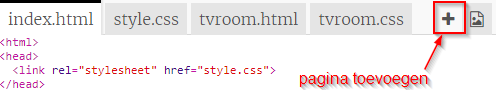
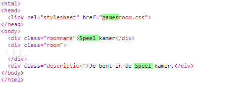
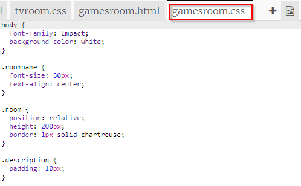
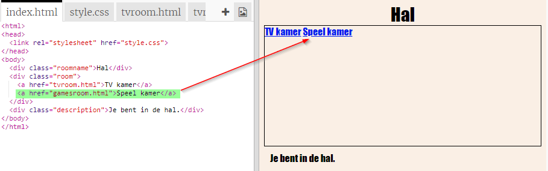
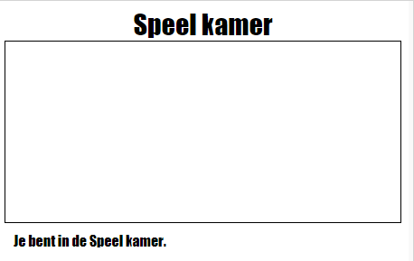

## Voeg nog een kamer toe

Laten we nu nog een kamer toevoegen, een **Games Room**.

+ Klik op de knop Pagina toevoegen **+**:
    
    
    
    Typ `gamesroom.html` als de paginanaam:
    
    

+ De HTML voor **Games Room** lijkt veel op `tvroom.html` dus **kopie** en **plakt** in `gamesroom.html`.
    
    Bewerk de gemarkeerde items zodat ze zeggen Games not TV:
    
    

+ Je `gamesroom.html` gebruikt nu `gamesroom.css` , wat nog niet bestaat.
    
    Maak `gamesroom.css` door op de knop pagina toevoegen **+** te klikken.

+ De CSS voor **Games Room** lijkt veel op `tvroom.css` dus **kopie** en **plakt** in `gamesroom.css`.
    
    

+ Voeg een link toe vanuit de hal naar de speelkamer:
    
    

+ Test uw project door op de koppeling Games Room te klikken
    
    De **Games Room** zou er als volgt uit moeten zien:
    
    
    
    Niet erg spannend, maar je kunt dat oplossen in de volgende uitdaging.