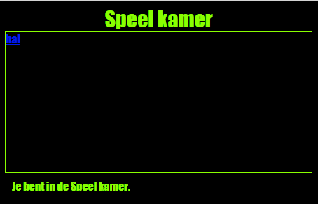

\--- challenge \---

## Uitdaging: de Speel Kamer vormgeven en linken

Bewerk de HTML en CSS voor **Speel Kamer** zodat de webpagina er als volgt uitziet:

Tip: je moet de achtergrondkleur, letterkleur en randkleur wijzigen in `gamesroom.css`. De felle groene kleur heet `chartreuse`.

Hint: You'll need to add an `<a>` link in `gamesroom.html` which links to `index.html`.

\--- /challenge \---