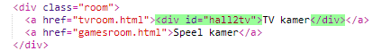
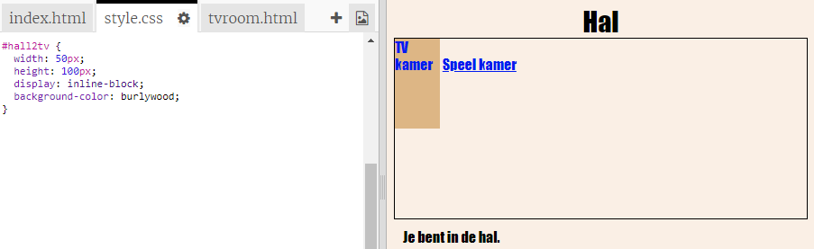
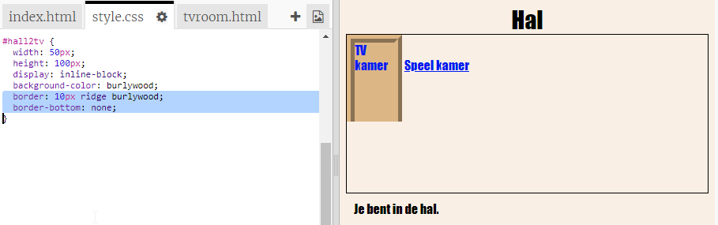
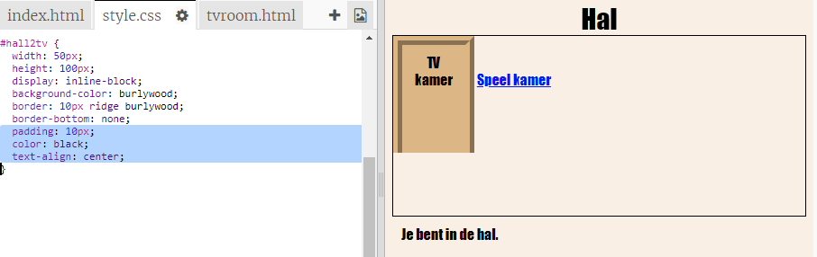
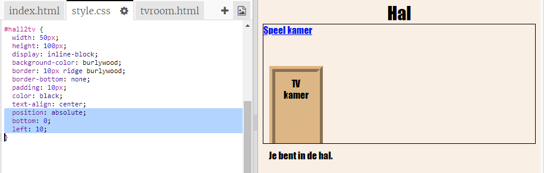

## Laat de links er als deuren uit zien

Links hoeven niet alleen tekst te zijn. Laten we een klikbare deur maken met behulp van een `
`.

+ Open `index.html` en voeg een `
` toe rond de **TV Kamer** link tekst. Het moet binnen in de `<a>` zitten om het klikbaar te maken.
    
    Voeg `id = "hall2tv"` toe om het te benoemen als 'deur van de hal naar de TV Kamer', zodat je de deur kunt vormgeven.
    
    

+ Klik op het tabblad `style.css` , ga naar beneden en voeg de volgende CSS toe om de grootte en kleur van de deur te wijzigen:
    
    

+ Test je webpagina door ergens op de deur te klikken, niet alleen op de tekst.

+ Laten we het nu een beetje meer op een deur laten lijken door een rand rond drie zijden toe te voegen:
    
    

+ En laten we wat CSS toevoegen om de tekst op de deur er beter uit te laten zien:
    
    

+ Je hebt waarschijnlijk gemerkt dat de deur in de lucht zweeft. Laten we dat oplossen door de deur in de kamer te plaatsen.
    
    

+ Test je webpagina door op de deur te klikken om in de **TV Kamer** te komen.