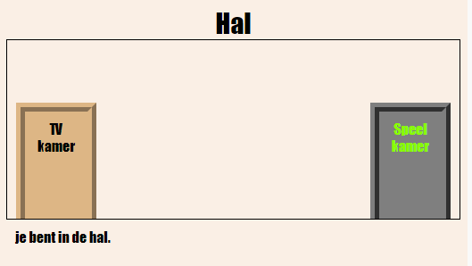
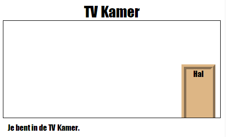

\--- uitdaging \---

## Uitdaging: voeg meer deuren toe!

Zet de andere schakels in uw project op dezelfde manier in de deuren.

Voor elke deur moet je:

+ Bewerk de link om een ​​ `
` te gebruiken met een id zoals `hall2games` , zodat je het kunt stylen.
    
    Bijvoorbeeld:
    
    `<a href="gamesroom.html">
Games Room
</a>`

+ Voeg CSS voor de deur-ID toe aan het `.css` bestand voor zijn kamer. Gebruik *kopie* en *plakken* om tijd te besparen. Je kunt elke deur er anders laten uitzien als je wilt.

+ Plaats de deur met behulp van `onder:` en `links:` of `rechts:`.

De hal kan er als volgt uitzien:

De tv-ruimte zou er ongeveer zo uit moeten zien:

\--- / uitdaging \---