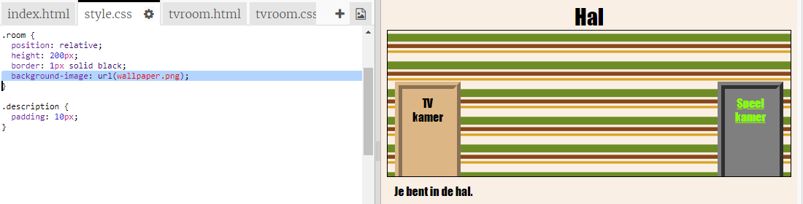

## Een achtergrondafbeelding toevoegen

Laten we de hal versieren met een achtergrondafbeelding.

+ Bewerk `style.css` om een ​​achtergrondafbeelding toe te voegen aan de hal:
    
    
    
    De afbeelding wordt herhaald om de hele kamer te vullen.