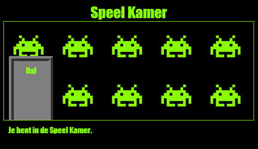

\--- uitdaging \---

## Uitdaging: achtergrond toevoegen aan de Games Room

Kun je de speelkamer decoreren met een achtergrondafbeelding?

U kunt de `space-invader.png` achtergrondafbeelding gebruiken die deel uitmaakt van uw project.

U moet het volgende doen:

+ Voeg een `achtergrondafbeelding toe:` aan de `.room` CSS voor de Games Room. 

De ingerichte kamer zou er als volgt uit moeten zien:

\--- / uitdaging \---