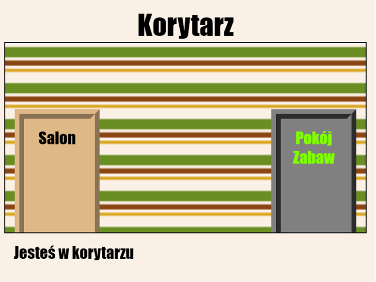

## Wprowadzenie

Wykonując ten projekt zbudujemy kilka połączonych pokojów - każdy pokój będzie osobną stroną internetową, którą możesz udekorować.

  <iframe src="https://trinket.io/embed/html/eab49f4f06?outputOnly=true&start=result" width="600" height="450" frameborder="0" marginwidth="0" marginheight="0" allowfullscreen>
  </iframe>
  

**Instrukcja**: kliknij na drzwi, aby przemieścić się między pokojami.

### Dodatkowe informacje dla prowadzących klub

Jeśli chcesz wydrukować ten projekt, użyj [wersji do druku](https://projects.raspberrypi.org/en/projects/linked-rooms/print).

## \--- collapse \---

## title: Notatki dla liderów klubów

## Wstęp:

Wykonując ten projekt dzieci dowiedzą się, jak linkować wiele stron internetowych z indywidalnymi plikami CSS w tym samym projekcie.

## Zasoby Online

Do pisania kodu HTML i CSS online rekomendujemy użytkowanie edytora [trinket](https://trinket.io/). Do tego projektu udostępnione są następujące szablony:

* [“Pokoje” - początek – jumpto.cc/web-rooms](https://trinket.io/html/f1486ddb24)

Dzieci mogą też używać pustego edytora [(jumpto.cc/html-blank)](http://jumpto.cc/html-blank) do pisania swojego kodu HTML i CSS lub skorzystać z tego szablonu [(jumpto.cc/html-template)](http://jumpto.cc/html-template).

Dostępny jest także projekt zawierający przykładowe rozwiązania wyzwań:

* [Ukończone “Pokoje” – https://trinket.io/html/ba5d27ec68](https://trinket.io/html/eab49f4f06)

## Zasoby Offline

Ten projekt można także [wykonać offline](https://www.codeclubprojects.org/en-GB/resources/webdev-working-offline/). Materiały potrzebne do wykonania projektu dostępne są po kliknięciu linku "Materiały do projektu". Ten link zawiera sekcję "Zasoby projektu", która zawiera zasoby, których dzieci będą potrzebować, aby ukończyć ten projekt w trybie offline. Upewnij się, że każde dziecko ma dostęp do tych zasobów. Ta sekcja zawiera następujące pliki:

* linked-rooms/index.html
* linked-rooms/style.css
* linked-rooms/script.js
* linked-rooms/prefixfree.js
* linked-rooms/4 x .png images
* template/template.html
* template/style.css

Ukończoną wersję zadań z tego projektu można również znaleźć w sekcji "Zasoby dla wolontariuszy", która zawiera:

* linked-rooms-finished/index.html
* linked-rooms-finished/style.css
* linked-rooms-finished/script.js
* linked-rooms-finished/prefixfree.js
* linked-rooms-finished/4 x .png images

(Wszystkie powyższe zasoby można również pobrać jako pliki `.zip`.)

## Cele dydaktyczne

* Ten projekt wprowadza tworzenie wielu stron html połączonych linkami
* Pojawia się także użycie wielu plików CSS

Projekt ten obejmuje elementy z następujących wątków [Cyfrowego programu nauczania Raspberry Pi](http://rpf.io/curriculum):

* [ Projektuj podstawowe zasoby 2D i 3D](https://www.raspberrypi.org/curriculum/design/creator).

## Zadania

* "Dodaj kolejny link" - dodaj link między stronami w tym samym projekcie;
* "Ostyluj i podlinkuj Pokój Zabaw" - dodaj link i ostyluj stronę plikiem CSS. 
* "Jeszcze więcej drzwi!" - użyj 

<

klasy 

  jako klikalnego linku + "Dodaj tapetę do Pokoju zabaw" - dodaj tło + "Zrób po swojemu!" - dodaj więcej pokoi wykorzystując zdobyte umiejętności +"Dodaj kursor w kształcie klucza" - zabawny dodatek dla tych, którzy ukończyli projekt.
 
  
  

    --- /collapse ---
  

  
  <h2>
    --- collapse ---
  </h2>
  
  <h2>
    title: Materiały do projektu
  </h2>
  
  <h2>
    Zasoby projektu
  </h2>
  
  <ul>
    <li>
      <a href="resources/rooms-project-resources.zip">Plik .zip zawierający wszystkie zasoby potrzebne do wykonania projektu</a>
    </li>
    <li>
      <a href="http://jumpto.cc/web-rooms">Trinket zawierający wszystkie zasoby projektu</a>
    </li>
    <li>
      <a href="http://jumpto.cc/trinket-template">Pusty szablon Trinket</a>
    </li>
    <li>
      <a href="http://jumpto.cc/trinket-blank">Pusty Trinket</a>
    </li>
    <li>
      <a href="resources/template-index.html">template/index.html</a>
    </li>
    <li>
      <a href="resources/template-style.css">template/style.css</a>
    </li>
    <li>
      <a href="resources/linked-rooms-index.html">linked-rooms/index.html</a>
    </li>
    <li>
      <a href="resources/linked-rooms-style.css">linked-rooms/style.css</a>
    </li>
    <li>
      <a href="resources/linked-rooms-tvroom.html">linked-rooms/tvroom.html</a>
    </li>
    <li>
      <a href="resources/linked-rooms-tvroom.css">linked-rooms/tvroom.css</a>
    </li>
    <li>
      <a href="resources/linked-rooms-wallpaper.png">linked-rooms/wallpaper.png</a>
    </li>
    <li>
      <a href="resources/linked-rooms-space-invader.png">linked-rooms/space-invader.png</a>
    </li>
    <li>
      <a href="resources/linked-rooms-tiles.png">linked-rooms/tiles.png</a>
    </li>
    <li>
      <a href="resources/linked-rooms-star.png">linked-rooms/star.png</a>
    </li>
    <li>
      <a href="resources/linked-rooms-stripes.png">linked-rooms/stripes.png</a>
    </li>
  </ul>
  
  <h2>
    Zasoby dla lidera klubu
  </h2>
  
  <ul>
    <li>
      <a href="resources/rooms-volunteer-resources.zip">Plik .zip zawierający zasoby z ukończonym projektem</a>
    </li>
    <li>
      <a href="https://trinket.io/html/eab49f4f06">Trinket zawierający ukończony projekt</a>
    </li>
    <li>
      <a href="resources/linked-rooms-finished-index.html">linked-rooms-finished/index.html</a>
    </li>
    <li>
      <a href="resources/linked-rooms-finished-style.css">linked-rooms-finished/style.css</a>
    </li>
    <li>
      <a href="resources/linked-rooms-finished-tvroom.html">linked-rooms-finished/tvroom.html</a>
    </li>
    <li>
      <a href="resources/linked-rooms-finished-tvroom.css">linked-rooms-finished/tvroom.css</a>
    </li>
    <li>
      <a href="resources/linked-rooms-finished-gamesroom.html">linked-rooms-finished/gamesroom.html</a>
    </li>
    <li>
      <a href="resources/linked-rooms-finished-gamesroom.css">linked-rooms-finished/gamesroom.css</a>
    </li>
    <li>
      <a href="resources/linked-rooms-finished-wallpaper.png">linked-rooms-finished/wallpaper.png</a>
    </li>
    <li>
      <a href="resources/linked-rooms-finished-space-invader.png">linked-rooms-finished/space-invader.png</a>
    </li>
    <li>
      <a href="resources/linked-rooms-finished-tiles.png">linked-rooms-finished/tiles.png</a>
    </li>
    <li>
      <a href="resources/linked-rooms-finished-star.png">linked-rooms-finished/star.png</a>
    </li>
    <li>
      <a href="resources/linked-rooms-finished-stripes.png">linked-rooms-finished/stripes.png</a>
    </li>
  </ul>
  
  

    --- /collapse ---
  
