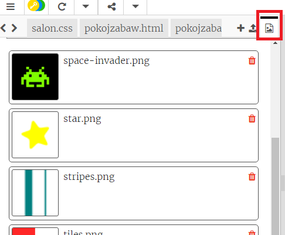

\--- wyzwanie \---

## Wyzwanie: Zrób po swojemu!

Dodaj więcej pokoi do swojego projektu. Pamiętaj, że możesz użyć **kopiuj** i **wklej**, aby oszczędzić czas i zmienić tylko niektóre rzeczy.

Dla każdego pokoju musisz:

+ Utworzyć plik `.html`
+ Dodać linki do i z nowego 'pokoju'
+ Utworzyć plik `.css`ze stylami dla Twojego nowego pokoju i jego drzwi

Możesz zmienić `background-color:` (kolor tła) dla każdego pokoju. Kliknij na ikonę obrazków, aby zobaczyć tła, które możesz wybrać:

\--- /challenge \---