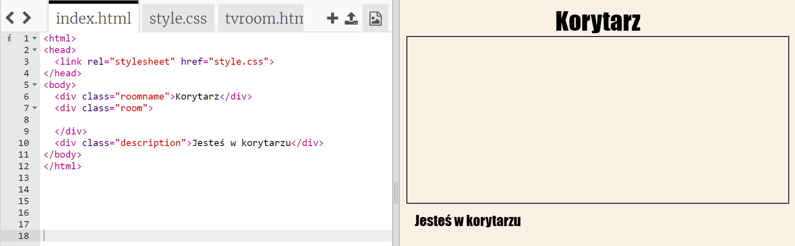
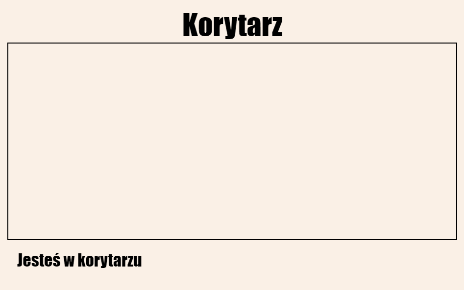
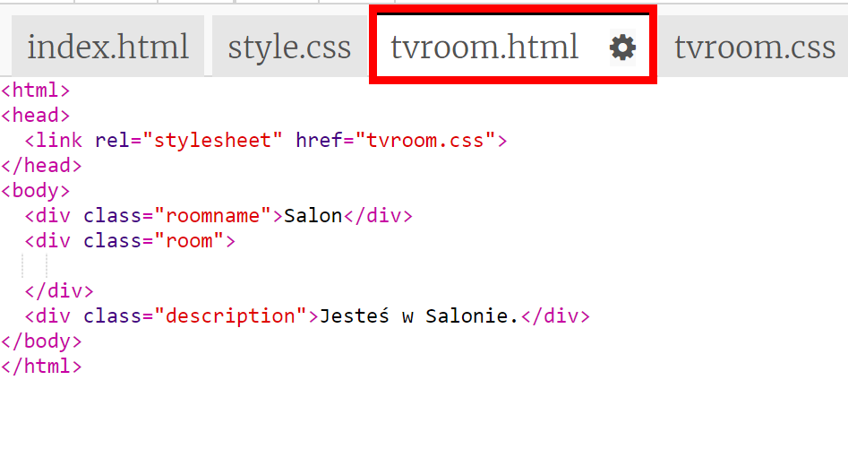
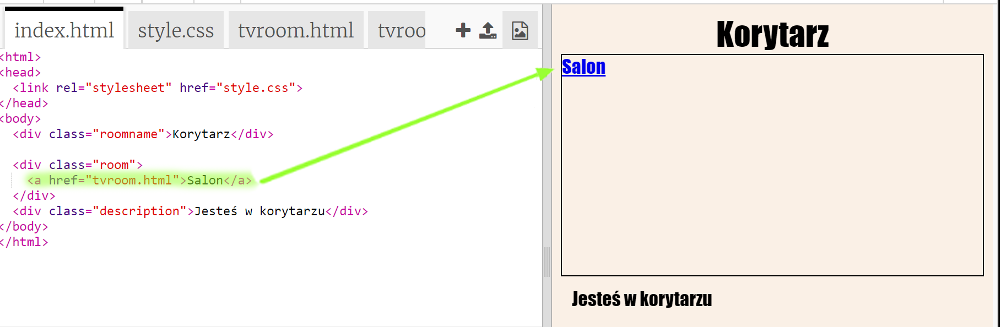
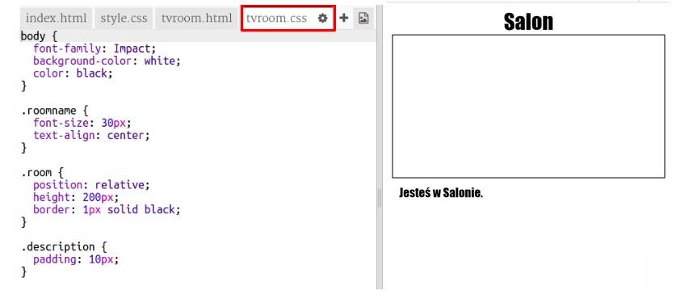

## Linkowanie do innej strony w tym samym projekcie

Strony intenetowe mogą być stworzone z wielu plików HTML połączonych ze sobą linkami.

+ Otwórz edytor: <a href="http://jumpto.cc/web-rooms" target="_blank">jumpto.cc/web-rooms</a>.
    
    Projekt powinien wyglądać następująco:
    
    

+ Trinket powinien uruchomić się automatycznie i skierować Cię do korytarza:
    
    

+ Spójrz na listę zakładek w tym trinkiecie. Czy widzisz tam plik `salon.html`? Kliknij na niego.
    
    
    
    To jest po prostu inny plik HTML w tym samym projekcie.

+ Aby wyświetlić `salon.html` musisz dodać link w `index.html`.
    
    Dodaj podświetlony kod wewnątrz `
` z klasą `room`:
    
    

+ Przetestuj swój projekt klikając na link **Salon**, by zobaczyć stronę `salon.html`.
    
    Zauważ, że plik `tvroom.html` również ma swój własny styl (`tvroom.css`), który ustala wygląd tej strony.
    
    