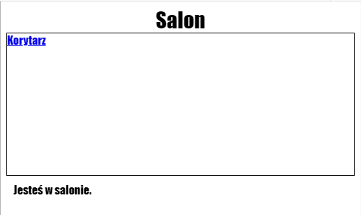

\--- challenge \---

## Wyzwanie: Dodaj kolejny link

Dodaj `<a>` link w pliku `tvroom.html`, który zabierze Cię z powrotem na stronę korytarza, o nazwie `index.html`. Tekstem linku powinien być "Korytarz".

Salon powinien mieć link, który możesz kliknąć:

Pamiętaj o przetestowaniu swojego programu. Klikanie na linki powinno umożliwiać Ci przemieszczanie się między Korytarzem i Salonem.

\--- /challenge \---