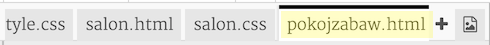
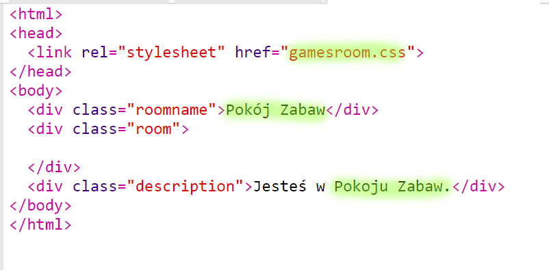
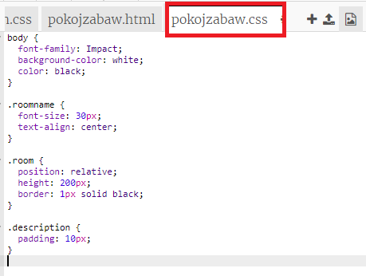
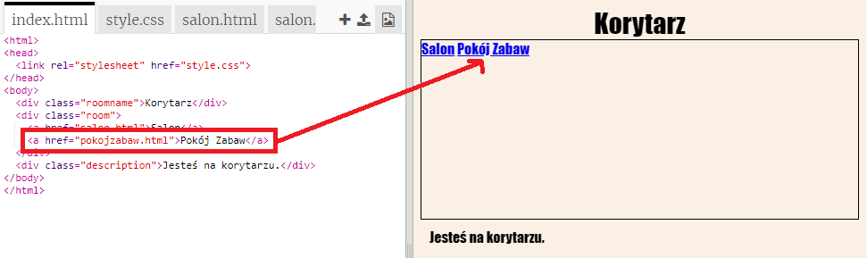
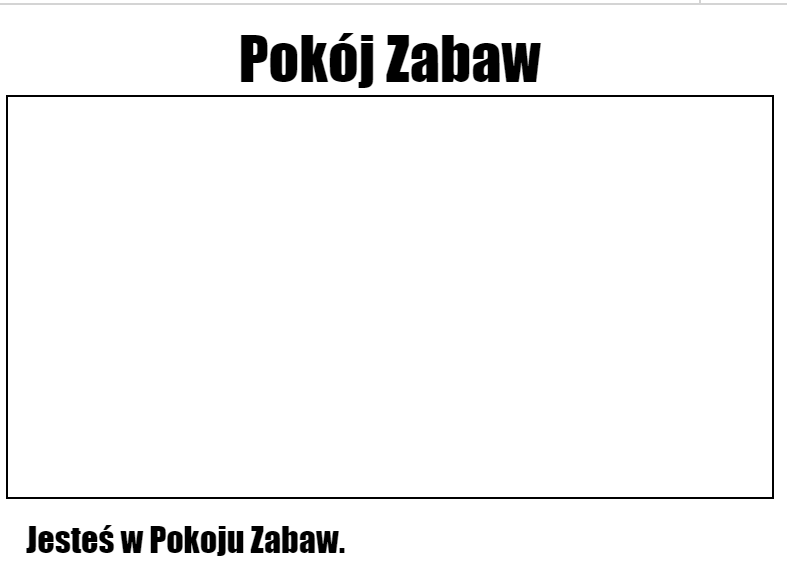

## Dodaj kolejny pokój

Dodajmy teraz inny pokój - **Pokój Zabaw**.

+ Kliknij na przycisk **+**, który służy do dodawania stron:
    
    
    
    Jako nazwę strony wpisz `gamesroom.html`:
    
    

+ Kod HTML dla **Pokoju Zabaw** jest bardzo podobny do tego z pliku `tvroom.html`więc możesz **skopiować go** i **wkleić**do pliku `gamesroom.html`.
    
    Zmień zaznaczone elementy, aby dotyczyły Pokoju Zabaw, a nie Salonu:
    
    

+ Twój `gamesroom.html` używa teraz pliku `gamesroom.css`, który jeszcze nie istnieje.
    
    Utwórz `gamesroom.css` klikając na przycisk dodawania nowej strony **+**.

+ Plik CSS dla **Pokoju Zabaw** jest bardzo podobny do `tvroom.css`, więc **skopiuj**jego zawartość i **wklej** ją do `gamesroom.css`.
    
    

+ Dodaj link z korytarza do Pokoju Zabaw:
    
    

+ Przetestuj swój projekt klikając na link do Pokoju Zabaw
    
    **Pokój Zabaw** powinien wyglądać mniej więcej tak:
    
    
    
    Niezbyt ekscytująco, ale możesz zmienić to podejmując poniższe wyzwanie.